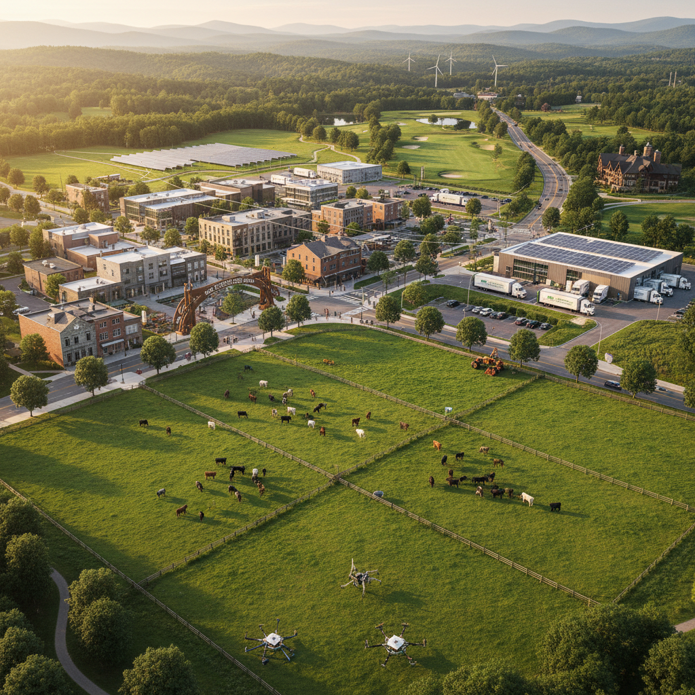

# From Frontier County Seat to Rural Innovation Hub: The Economic Transformation of Lebanon, Virginia

## A Comprehensive Strategic Framework for Agricultural Modernization, Technology Integration, and Regional Prosperity in Southwest Virginia's Heartland
## By Anthony Matarazzo (c) 2026

---

# Part One: The Historical Foundation of Economic Resilience

## Chapter 1: Introduction - Lebanon at the Crossroads of Appalachian Opportunity

The town of Lebanon, Virginia, population 3,424 according to the most recent census data, represents one of the most compelling case studies in rural economic transformation currently unfolding in the United States. Situated at the geographical heart of Southwest Virginia within the majestic Clinch Mountain range, this small but resilient community serves as the county seat of Russell County and has evolved from a modest frontier settlement into a diversified economic center that defies the typical narrative of Appalachian decline. The town's strategic location at the intersection of U.S. Routes 19 and 58 positions it as a natural hub for commerce, transportation, and service provision across a multi-county region that encompasses approximately 200,000 residents and thousands of square miles of productive agricultural and forested land. Lebanon's journey from its founding in 1818 to its present-day status as a burgeoning technology and agriculture hub illustrates the power of deliberate economic planning, community collaboration, and strategic investment in infrastructure and human capital. This comprehensive document presents a detailed strategic framework designed to guide Lebanon's next phase of economic growth through the integration of agricultural modernization, advanced manufacturing, robotics technology, regional logistics, and sustainable tourism development.

The economic transformation of Lebanon has been neither accidental nor sudden but rather represents the culmination of decades of intentional community effort, strategic planning, and adaptive response to changing economic conditions. Following the catastrophic decline of the coal industry in the 1980s, when unemployment rates in Russell County exceeded 14 percent and the community witnessed an exodus of talented workers seeking opportunities elsewhere, Lebanon's civic and business leaders made a conscious and deliberate choice to reinvent their local economy. Rather than accepting decline as inevitable, these leaders embraced a vision of diversification that would build upon the community's existing strengths—its central location, its agricultural heritage, its strong work ethic, and its commitment to education and community development. The establishment of the Virginia Coalfield Economic Development Authority (VCEDA) in 1988 provided the institutional framework and funding mechanisms necessary to transform this vision into reality, creating a model for rural economic development that has attracted attention from economists and policymakers across the nation. Today, Lebanon stands as a remarkable example of successful rural economic diversification, with a robust economic base that spans government services, healthcare, education, manufacturing, information technology, agriculture, and professional business services.

The town's advanced broadband infrastructure, anchored by the CPC OptiNet fiber-optic network completed in 2004, provides connectivity that rivals that of major metropolitan areas and has proven instrumental in attracting technology companies and remote workers to the region. Three industrial parks—the Russell County Industrial Park, the Cumberland Plateau Regional Industrial Park, and the Russell Regional Business Technology Park—provide the physical infrastructure necessary for manufacturing, warehousing, and technology operations, while the town's strategic location within a day's drive of major metropolitan areas including Washington D.C., Charlotte, Nashville, Atlanta, and Cincinnati positions it as an ideal distribution hub for the eastern United States. The presence of higher education institutions including Southwest Virginia Community College, Mountain Empire Community College, and the University of Virginia's College at Wise ensures a steady pipeline of skilled workers trained in the disciplines essential for modern economic competitiveness. These educational assets, combined with the Russell County Career and Technical Center, provide a comprehensive workforce development ecosystem that spans from high school vocational training through associate and baccalaureate degree programs, ensuring that Lebanon's workforce remains adaptable to evolving economic opportunities.

The economic principles underlying Lebanon's transformation align closely with established theories of regional economic development, particularly those emphasizing the importance of diversified economic bases, strategic infrastructure investment, and human capital development. Economic base theory, as articulated by scholars including Homer Hoyt and later refined by regional economists, suggests that communities with diversified economic structures are more resilient to sectoral shocks and better positioned for sustained growth than those dependent on single industries. Lebanon's deliberate diversification strategy, moving from coal dependence to a multi-sector economy, exemplifies this principle and has contributed significantly to the community's economic stability. Similarly, the concept of agglomeration economies—the benefits that firms derive from locating near one another—has supported the development of Lebanon's industrial parks, where businesses benefit from shared infrastructure, access to specialized suppliers, and proximity to a trained workforce. The town's investment in broadband infrastructure reflects the recognition that in the twenty-first-century economy, connectivity is as essential as roads and utilities for attracting and retaining businesses.

Agricultural economics provides an additional lens through which to understand Lebanon's growth potential, particularly as the town seeks to modernize its cattle industry and expand into value-added agricultural products. The region's agricultural heritage, grounded in the production of hay, corn, cattle, and tobacco, has provided a foundation for economic activity since the town's founding, and livestock production remains the county's largest agricultural sector by economic value. The 2022 Census of Agriculture documented approximately 37,017 cattle and calves on 808 farms across Russell County, with nearly 176,732 acres devoted to farmland, and the market value of agricultural products sold reached $40,006,000, representing a remarkable 72 percent increase from 2017. This substantial agricultural base represents not only an existing economic sector but also a platform for growth through modernization, automation, and value-added processing, with cattle and calves alone accounting for $35,160,000 in sales and ranking Russell County sixth among Virginia's 98 counties in cattle production. The economic principles of comparative advantage suggest that Lebanon's producers should focus on products where they enjoy relative cost advantages, such as premium beef production supported by the region's abundant pastureland, moderate climate, and access to regional markets.

The town's transportation infrastructure, including access to Interstate 81, Interstate 77, and Interstate 26, provides logistical advantages that support both agricultural and manufacturing growth. These interstate corridors connect Lebanon to major population centers and consumption markets, enabling efficient distribution of both raw materials and finished products. The economic concept of location rent—the additional value derived from strategic positioning—suggests that Lebanon's location within a day's drive of Washington D.C., Charlotte, Nashville, Atlanta, and Cincinnati provides significant competitive advantages for businesses serving these markets. The presence of Norfolk Southern rail lines in surrounding communities offers additional transportation options for bulk commodities and manufactured goods, while nearby airports including Tri-Cities Airport and the Abingdon Virginia Highlands Airport provide air freight capabilities for time-sensitive shipments. This logistical infrastructure positions Lebanon as an ideal location for cold-chain distribution, regional warehousing, and manufacturing operations serving the eastern United States, with the capacity to reach over 50 million consumers within a single day's drive.

The demographic and labor market characteristics of Lebanon and surrounding Russell County present both opportunities and challenges for economic development. The region's population has remained relatively stable in recent years, with a workforce characterized by strong work ethic, manufacturing experience, and agricultural knowledge that has been passed down through generations of farming families. However, like many rural areas, the region faces challenges including an aging population, limited in-migration of young workers, and skills gaps in emerging technology fields that require sophisticated training in robotics, automation, and data analytics. Addressing these challenges requires strategic investments in workforce development, educational programming, and initiatives to attract and retain talent through enhanced quality of life amenities and economic opportunities. The presence of multiple higher education institutions within commuting distance provides the foundation for such efforts, while programs such as the Appalachian Prosperity Project and workforce development initiatives supported by VCEDA offer resources for training and skills upgrading that are specifically tailored to the region's economic priorities. The economic concept of human capital suggests that investments in education and training yield substantial returns through increased productivity, innovation, and entrepreneurship, particularly when aligned with emerging industry clusters.

The tourism potential of Lebanon and the surrounding region represents a significant opportunity for economic diversification and growth. The town's location along The Crooked Road Heritage Music Trail, combined with its access to outdoor recreation opportunities in the Clinch Mountains and surrounding forests, positions it to capture a growing share of the heritage and adventure tourism markets that have demonstrated strong growth in the Appalachian region. Recent investments in community amenities—including the new Community Center, pool, Russell Theater, pavilion, and pickleball courts with lighting—have enhanced the town's quality of life and appeal to visitors, while the Clinch River offers world-class fishing and kayaking opportunities that attract outdoor enthusiasts from across the eastern United States. The economic concept of tourism multipliers suggests that tourism spending generates additional economic activity through direct, indirect, and induced effects, supporting jobs in hospitality, retail, transportation, and other service sectors, with each dollar of visitor spending generating approximately $1.50 to $2.50 in total economic impact. Strategic development of tourism assets, including the proposed championship golf course, can extend the tourism season beyond the traditional summer months and attract higher-spending visitors, while integration with agricultural tourism (agritourism) can create synergies between farming and hospitality sectors that benefit both industries.

The manufacturing sector in Lebanon and surrounding Russell County has experienced notable growth in recent years, demonstrating the community's attractiveness to industrial employers. Major announcements include Simmons Equipment's $8.5 million expansion into Russell County from neighboring Tazewell County, bringing manufacturing jobs and investment to the community, while VFP, a custom enclosure manufacturer, has announced a $5 million expansion in nearby Scott County. The Lonesome Pine Regional Industrial Facilities Authority, which includes Lee, Wise, Scott, and Dickenson counties and the City of Norton, provides a platform for regional cooperation in industrial development, including the development of Project Intersection, a 200-acre industrial megasite on reclaimed coal mine land that represents a model for repurposing former mining areas for productive economic use. The economic concept of industrial clusters—geographic concentrations of interconnected businesses, suppliers, and associated institutions—suggests that existing manufacturing in Lebanon can be leveraged to attract additional firms and support the development of related industries, including robotics manufacturing for agricultural and industrial applications that leverage the region's workforce skills and educational resources.

The environmental and natural resource assets of the Lebanon region provide both economic opportunities and responsibilities for sustainable management. The region's forests, waterways, and agricultural land contribute to its economic base through timber production, farming, and tourism, while also providing ecosystem services including water filtration, carbon sequestration, and wildlife habitat that have measurable economic value. The Clinch River, recognized as one of the most biodiverse river systems in North America with more than 50 species of freshwater mussels and numerous fish species, supports both aquatic life and recreational activities including fishing and kayaking that attract visitors and generate economic activity. The economic concept of natural capital emphasizes the importance of maintaining these environmental assets for long-term economic sustainability, while the principles of sustainable development suggest that economic growth should be pursued in ways that preserve natural resources for future generations. Lebanon's position as a gateway to the Clinch Mountain range positions it to benefit from growing demand for outdoor recreation and nature-based tourism, while responsible environmental stewardship protects the natural assets that make the region attractive to visitors and residents alike.

The community's commitment to quality of life and civic engagement provides a foundation for sustainable economic development that has proven resilient through periods of economic challenge. Lebanon's downtown, anchored by the historic Russell County Courthouse and characterized by local businesses including restaurants, shops, and professional services, reflects a commitment to maintaining a vibrant community center despite competition from big-box retailers and online commerce. The town's investment in streetscape improvements, new sidewalks, and public gathering spaces demonstrates a vision for walkable, attractive communities that appeal to both residents and visitors, while the recent completion of the Community Center, pool, and pavilion provides recreational amenities that enhance quality of life. The historical significance of sites such as Elk Garden Church, the second-oldest church in Russell County, and Jessee's Mill, a 200-year-old mill that predates the 1790 census, provides heritage tourism assets that connect modern Lebanon to its frontier past. This combination of historical preservation, community investment, and strategic vision positions Lebanon to continue its economic transformation while maintaining the character and quality of life that make it a special place to live and work.

---

## Chapter 2: The Climate and Geological Foundation of Lebanon's Agricultural Economy

### 2.1 Understanding Lebanon's Climate Regime Through Scientific Analysis

Lebanon, Virginia, experiences a humid subtropical climate according to the Köppen classification system, designated as Cfa, which is characterized by hot, humid summers and cool to cold winters with precipitation distributed throughout the year . This climate classification places Lebanon in a category that is particularly well-suited for pasture-based cattle production, as the region receives an average of 46.6 inches of annual precipitation that supports lush forage growth from spring through autumn . The climate data from PlantMaps reveals that Lebanon's average annual high temperature is 65.2 degrees Fahrenheit, while the average annual low is 42.8 degrees Fahrenheit, creating a thermal regime that allows for a growing season of approximately 204 days from early April through late October . This extended growing season provides cattle producers with a substantial window for pasture growth and hay production, reducing the reliance on purchased feed and supporting the economic viability of cow-calf operations in the region.

The monthly temperature patterns in Lebanon demonstrate the seasonal variations that influence cattle management decisions throughout the year. January, the coldest month, has average low temperatures of 23.8 degrees Fahrenheit and average highs of 43.6 degrees Fahrenheit, conditions that require winter feeding and shelter for livestock . February sees slight warming with average lows of 26.5 degrees and highs of 47.4 degrees, while March brings more substantial warming with average lows of 32.5 degrees and highs of 55.7 degrees, marking the beginning of the spring forage growth period . April, with average lows of 41.4 degrees and highs of 66.1 degrees, represents the transition to the active growing season, and May through September provide the warmest conditions with July highs reaching 83.2 degrees and lows of 62.0 degrees . This temperature regime, which limits the number of days with temperatures exceeding 90 degrees to just 4.6 per year, is significantly more moderate than conditions in the Deep South and provides cattle with a more comfortable environment that reduces heat stress and supports higher conception rates .

The precipitation patterns in Lebanon are particularly favorable for pasture-based cattle production, with monthly rainfall averaging between 2.69 inches in October and 4.92 inches in July, providing consistent moisture throughout the growing season . The annual rainfall of 45.1 inches exceeds the United States average of 38 inches, and the region experiences 135.6 days of measurable precipitation each year, ensuring that pastures and hayfields receive adequate moisture for sustained growth . May is the wettest month with an average of 3.4 inches of rainfall, followed closely by July with 3.4 inches, while October is the driest month with 2.3 inches . This pattern, known as a bimodal precipitation regime, provides excellent conditions for cool-season grasses that dominate Appalachian pastures, as the spring and early summer rains support vigorous growth and the late summer and early fall rains provide recovery for fall grazing . The region experiences approximately 200 sunny days annually, which balances the moisture availability with adequate solar radiation for plant growth, supporting the high-quality forage production that is essential for premium beef production .

The growing season in Lebanon, defined as the period without freezing temperatures, typically extends from April 8 to October 29, providing 204 days of frost-free conditions that support diverse forage production . The last spring frost typically occurs between May 1 and May 10, while the first fall frost typically arrives between October 11 and October 20, giving producers approximately 100 to 125 days with frost conditions . Lebanon is located in USDA Plant Hardiness Zone 7a, with minimum temperatures ranging from 0 to 5 degrees Fahrenheit, which has shifted from Zone 6b (-5 to 0 degrees) in the 2012 map, reflecting broader climatic warming trends . This zone classification is significant for forage species selection, as it supports perennial cool-season grasses such as orchardgrass, tall fescue, and timothy that form the foundation of the region's cattle pastures, along with legumes like red clover and alfalfa that provide high-quality nutrition . The warming trend suggests that producers may have opportunities to expand the range of forage species and extend grazing seasons, potentially increasing carrying capacity and reducing winter feed costs.

The region's growing degree days, a measure of heat accumulation used to predict plant development, further inform agricultural planning and forage management. Based on a base temperature of 50 degrees Fahrenheit, Lebanon accumulates sufficient heat units to support robust growth of cool-season forages from early spring through late fall, with the highest accumulation occurring during the warm months of June, July, and August . The first spring blooms in the region typically appear around March 18, signaling the beginning of the botanical growing season and providing an early indicator for forage management planning . For cattle producers, understanding these temperature accumulation patterns is essential for timing pasture rotation, hay cutting, and stockpile management, as forage quality declines rapidly once plants reach reproductive stages. The integration of climate data with precision agriculture technologies can enable Lebanon producers to optimize grazing management and hay production, improving both the quantity and quality of forage available for cattle and reducing the need for expensive supplemental feed.

### 2.2 Geological Foundation and Soil Characteristics of Russell County

The geological framework of Lebanon and surrounding Russell County provides the fundamental substrate upon which the region's agricultural productivity depends, with the underlying geology determining soil characteristics that significantly influence cattle production potential. Russell County is situated within the Appalachian Valley and Ridge province, a geological formation characterized by folded and faulted sedimentary rocks that were formed during the Paleozoic Era and subsequently uplifted and eroded over millions of years . The county's bedrock is composed primarily of limestone, dolomite, sandstone, and shale, with the limestone formations being particularly significant for agricultural productivity as they weather to form deep, fertile soils . These geological formations provide the parent material for the region's soils, and their mineral composition directly influences the nutrient availability, pH levels, and water-holding capacity that determine forage productivity and cattle carrying capacity . The variable geological composition across Russell County, with areas of limestone interspersed with sandstone and shale, creates a mosaic of soil types that require differentiated management approaches for optimal production.

The reaction ranges of Russell County soils, as documented by USDA-NRCS soil surveys, vary from slightly acid to strongly acid, with the notable exception of bottomlands near streams and areas underlain by limestone where the pH is typically higher . Most soils in the county are comparatively low in important nutrients, including nitrogen, phosphorus, potash, lime, and magnesium, though soils developed over limestone and those in bottomlands generally contain higher concentrations of these essential nutrients . This nutrient deficiency pattern has significant implications for cattle production, as the forage grown on these soils will have lower nutritional quality unless fertilizers are applied to supplement the natural fertility. Research conducted on soils in Russell County has identified specific soil series including the Pisgah silt loam, which is developed from highly calcareous limestone, and the Clarksville cherty silt loam, which is underlain by dolomitic limestone . The Pisgah silt loam is considered one of the more productive soils in the region, with good internal and external drainage and low erosion on slopes below 15 percent, making it particularly suitable for pasture and hay production .

The organic matter content of Russell County soils is generally modest, with dark-colored organic matter derived primarily from the decay of leaves and twigs in forested areas contributing to the topmost inch or two of the surface soil . In pasture areas, grass roots and residues contribute organic matter to the upper portion of the surface soil, gradually improving soil structure and water-holding capacity over time with proper management . Brown soils derived from alluvial material near streams and colluvial material near the bases of slopes contain a moderate quantity of well-decomposed organic matter in the surface soil, making these areas particularly productive for forage production . The organic matter content of soils is a critical factor in cattle production, as it influences soil structure, nutrient cycling, and water infiltration, all of which affect forage productivity and thus the carrying capacity of pasture land. Practices that build soil organic matter, including rotational grazing, cover cropping, and manure application, can significantly improve the productivity of Lebanon's pasture and hay land, enhancing the region's capacity for cattle production.

Recent research on soil genesis in Russell County has focused on understanding the relationship between soil productivity and the underlying rock formation, with particular attention to soils developed from limestone materials . Studies have demonstrated that the Hagerstown soils, which were historically considered among the most fertile developed over limestone, show significant variation depending on the specific limestone formation from which they developed . The Pisgah silt loam, which developed over highly calcareous limestone belonging to the Lenoir formation, is considered to have high agricultural value, while the Clarksville cherty silt loam, which developed over dolomitic limestone known as the Nittany dolomite, contains a considerable quantity of chert that reduces its agricultural potential . This geological complexity underscores the importance of detailed soil mapping for agricultural planning in Russell County, as the variability in soil characteristics directly influences pasture productivity, fertilizer requirements, and the economic viability of cattle operations. The comprehensive soil survey of Russell County completed by USDA-NRCS provides farmers and agricultural planners with detailed information on soil characteristics, classification, and appropriate management practices that can guide decisions about pasture establishment, fertilization, and grazing systems .

The soil drainage characteristics of Russell County vary significantly across the landscape, with implications for cattle production and pasture management. The Pisgah silt loam soils, which are well-drained and occur on slopes below 15 percent, provide good growing conditions for pasture species and are suitable for hay production and rotational grazing systems . In contrast, soils in valley bottoms and areas with poor drainage may require artificial drainage systems or careful selection of forage species that tolerate wet conditions, limiting their productivity for cattle operations . The depth to bedrock and the presence of stones and chert in the soil profile also influence agricultural potential, with steeper slopes and cherty soils being less productive and more challenging to manage for pasture and hay production . The interaction between geology, topography, and drainage creates a landscape that is well-suited for pasture-based livestock production across a significant portion of the county, with the caveat that management practices must be tailored to the specific characteristics of each soil type to achieve optimal productivity. This recognition of soil variability supports the economic principle that input optimization should be site-specific, with fertilizer and management investments targeted to the most productive soils to maximize economic returns.

### 2.3 Agricultural Economics and Cattle Production Data for Russell County

The agricultural economic data for Russell County reveals a sector that is both substantial and rapidly growing, with cattle production dominating the agricultural landscape and providing the primary source of farm income. According to the 2022 Census of Agriculture, the total market value of agricultural products sold in Russell County reached $40,006,000, representing an extraordinary 72 percent increase from 2017, when sales totaled $23,204,000 . This remarkable growth in agricultural sales far outpaced inflation and suggests significant expansion in both production volume and market prices, with livestock and poultry and their products accounting for $36,145,000 or 90 percent of all agricultural sales in the county . Cattle and calves sales alone reached $35,160,000, representing approximately 88 percent of all agricultural sales in the county and ranking Russell County sixth among Virginia's 98 counties in cattle sales . This dominance of cattle in the agricultural economy underscores the importance of this sector to Russell County's economic well-being and the potential for further growth through value-added processing and premium marketing strategies.

The number of farms in Russell County has declined to 808 in 2022, a 12 percent decrease from 2017, consistent with broader national trends toward agricultural consolidation, though the average farm size has increased to 219 acres, an 18 percent increase from 2017 . This trend toward fewer, larger farms reflects the economic pressures in agriculture that favor economies of scale, though it also suggests opportunities for beginning farmers to enter production through smaller, highly efficient operations that leverage technology and premium marketing strategies. The land in farms increased by 4 percent to 176,732 acres, indicating that despite the decline in farm numbers, the total agricultural land base in Russell County remains stable . Per farm average market value of products sold increased dramatically from $25,277 in 2017 to $49,513 in 2022, a 96 percent increase that reflects both the growth in cattle production and the higher prices received for beef cattle . These economic data demonstrate that Russell County cattle producers have successfully navigated market challenges and capitalized on growing demand for beef, creating a solid foundation for further investment in value-added production.

The net cash farm income in Russell County increased significantly from $3,908,000 in 2017 to $5,450,000 in 2022, a 39 percent increase that demonstrates the growing profitability of the agricultural sector . Total farm production expenses increased by 75 percent to $36,686,000 in 2022, reflecting the rising costs of inputs including feed, fertilizer, labor, and equipment, while government payments increased by 62 percent to $435,000, providing some support to producers during periods of market volatility . The ratio of net cash farm income to total sales provides an indicator of profitability, which in Russell County was approximately 13.6 percent in 2022, suggesting that the majority of producers are achieving positive returns despite rising input costs . Agricultural economists have noted that pasture-based cattle operations in Appalachia can achieve profitability through cost minimization rather than production maximization, with research from Virginia Tech indicating that reducing costs is often a better focus for cow-calf enterprises than increasing production . This finding has important implications for Lebanon-area producers, suggesting that investments in rotational grazing, efficient feed systems, and automation technologies can improve profitability without necessarily increasing herd size or production intensity.

The 2022 Census of Agriculture also provides data on crop production in Russell County, which complements the livestock sector and contributes to the integrated agricultural system. Other crops and hay sales totaled $2,262,000, ranking Russell County 26th among Virginia counties, and reflecting the importance of forage production for the cattle industry . Grains, oilseeds, dry beans, and dry peas contributed $1,067,000 in sales, vegetables, melons, potatoes, and sweet potatoes contributed $200,000, and fruits, tree nuts, and berries contributed $108,000 . The tobacco sector has declined substantially from previous decades, with sales of $31,000 in 2022, reflecting broader national trends in tobacco consumption and production . Forage-land used for all hay and haylage, grass silage, and greenchop totaled 26,305 acres in 2012, making it the top crop item in the county by acreage and highlighting the importance of forage production for the cattle industry . This integration of crop and livestock production creates synergies in the agricultural system, with hay and silage supporting the cattle sector while cattle manure provides nutrients for crop and forage production, creating a more sustainable and economically efficient system.

The livestock inventory data for Russell County further illustrates the scale and significance of the cattle sector, with 55,987 cattle and calves counted in the 2012 Census, the most recent year for which detailed inventory data is available . This represents a significant decline from the 37,017 cattle and calves reported in the 2022 Census, though it is important to note that the 2012 data may have included different counting methodologies . The rank of cattle inventory and sales suggests that Russell County consistently ranks among Virginia's top cattle-producing counties, typically placing in the top seven to nine counties . Sheep and lambs, with an inventory of 2,202, and goats, with 1,273, also contribute to the county's livestock economy, providing diversification opportunities for producers interested in mixed-species grazing systems . Research has demonstrated that mixed-species grazing with cattle and sheep can improve pasture utilization, reduce parasite loads, and increase overall production efficiency in cool-temperate regions like Appalachian Virginia . The presence of these complementary livestock sectors in Russell County suggests opportunities for producers to diversify their operations, potentially increasing profitability and reducing risk through integrated grazing systems.

### 2.4 Climate-Smart Agriculture and Sustainability Opportunities

Recent federal initiatives, including the Grazing for Appalachian Sustainability (GRASS) program, have created significant opportunities for Lebanon-area cattle producers to adopt climate-smart agricultural practices while receiving substantial financial incentives. The GRASS project, a partnership led by West Virginia University Extension and funded through the USDA Partnerships for Climate-Smart Commodities, has over $3.5 million available to incentivize producer participation in sustainable grazing programs . The project aims to improve knowledge and management practices for 135 small and underserved farmers in Central Appalachia, including 80 farmers in 25 western counties of Virginia, with a goal of expanding markets for climate-smart cattle and beef . Participating farmers may qualify for annual cash incentives of approximately $20,000 per producer for implementation of conservation practices, $5,000 per producer for reporting assistance, and additional compensation for participation in grazing schools and mentoring programs . These financial incentives provide powerful economic motivation for Lebanon-area producers to adopt sustainable practices that improve soil health, increase productivity, and open access to premium markets for climate-smart beef.

The climate-smart practices supported by the GRASS project are specifically designed to improve soil health, reduce greenhouse gas emissions, and support carbon sequestration while boosting economic outcomes for Appalachian farmers . Approved practices include alley cropping, silvopasture, fencing, pasture and hay planting, prescribed grazing, nutrient management, tree and shrub establishment, and watering facilities, all of which have been validated by the USDA Natural Resources Conservation Service . Silvopasture, which integrates trees with grazing pastures, and prescribed grazing, which uses rotational systems to manage forage growth and soil health, are particularly encouraged practices that offer multiple benefits for cattle producers . The adoption of these practices aligns with the concept of natural capital in environmental economics, as investments in soil health and conservation practices produce both private benefits to producers (improved pasture productivity, reduced input costs) and public benefits (carbon sequestration, water quality protection, biodiversity conservation). The availability of financial incentives through the GRASS project can help overcome the upfront costs and perceived risks associated with transitioning to sustainable grazing systems, accelerating the adoption of practices that improve long-term productivity and profitability.

The economic potential of climate-smart beef production extends beyond the direct incentives provided by the GRASS project, as growing consumer demand for sustainably produced food creates opportunities for premium pricing. Market research indicates that consumers are increasingly willing to pay a premium for beef produced with environmental stewardship practices, including those that improve soil health, reduce greenhouse gas emissions, and enhance carbon sequestration . The climate-smart markets that the GRASS project aims to develop represent an emerging opportunity for Lebanon-area producers to differentiate their products and capture higher prices, complementing the premium beef markets discussed in this plan . The combination of financial incentives for practice adoption, premium prices for climate-smart products, and long-term improvements in pasture productivity creates a compelling economic case for transitioning to sustainable grazing systems. This transition not only enhances producer profitability but also positions Lebanon and Russell County as leaders in sustainable agriculture, potentially attracting additional investment and market opportunities in the growing regenerative agriculture sector.

# Part Two: Agricultural Growth Strategy

## Chapter 3: The Current Agricultural Landscape of Russell County

### 3.1 The Economic Significance of Agriculture in Lebanon's Regional Economy

Agriculture remains a vital and growing component of Lebanon's economic foundation, with the 2022 Census of Agriculture revealing remarkable growth in the sector that far outpaces national averages and demonstrates the region's agricultural potential. The total market value of agricultural products sold in Russell County reached $40,006,000 in 2022, representing an extraordinary 72 percent increase from the $23,204,000 recorded in the 2017 Census, a growth rate that significantly exceeded both inflation and the broader agricultural trends observed across Virginia and the nation . This dramatic increase in agricultural sales reflects a combination of factors including higher cattle prices, expanded production, and improved market access, all of which suggest that Russell County's agricultural sector is experiencing a period of robust growth and opportunity. Livestock, poultry, and their products accounted for $36,145,000, or 90 percent of all agricultural sales in the county, demonstrating the overwhelming dominance of animal agriculture in the local economy and the critical importance of cattle production to the region's economic well-being.

The cattle and calves sector alone generated $35,160,000 in sales in 2022, representing approximately 88 percent of all agricultural sales in Russell County and ranking the county sixth among Virginia's 98 counties in cattle production . This remarkable concentration of agricultural value in the cattle sector underscores the importance of this industry to Lebanon's economic foundation and highlights the potential for further growth through value-added processing and premium marketing strategies. The per-farm average market value of products sold increased dramatically from $25,277 in 2017 to $49,513 in 2022, a 96 percent increase that reflects both the growth in cattle production and the higher prices received for beef cattle in the post-pandemic market environment. These economic data demonstrate that Russell County cattle producers have successfully navigated market challenges and capitalized on growing demand for beef, creating a solid foundation for further investment in value-added production, automation, and premium marketing strategies that can capture even greater value from the region's agricultural output.

The number of farms in Russell County declined to 808 in 2022, a 12 percent decrease from 2017, reflecting broader national trends toward agricultural consolidation and the economic pressures that favor larger, more efficient operations. However, the average farm size increased to 219 acres, an 18 percent increase from 2017, and total land in farms increased by 4 percent to 176,732 acres, indicating that despite the decline in farm numbers, the total agricultural land base in Russell County has remained stable and productive . This trend toward fewer, larger farms reflects the economic pressures in agriculture that favor economies of scale, though it also suggests opportunities for beginning farmers to enter production through smaller, highly efficient operations that leverage technology and premium marketing strategies. The net cash farm income in Russell County increased significantly from $3,908,000 in 2017 to $5,450,000 in 2022, a 39 percent increase that demonstrates the growing profitability of the agricultural sector and provides a solid foundation for reinvestment in modernization and expansion.

The agricultural infrastructure supporting Russell County's cattle industry is robust and well-established, with multiple organizations providing essential services, marketing opportunities, and educational support to producers in the region. The Abingdon Feeder Cattle Association provides a venue for producers to market their cattle collectively, achieving better prices through volume and quality assurance programs that verify the health and genetics of the animals being sold. The Russell County Cattlemen's Association serves as the local voice for cattle producers, advocating for policies that support the industry and providing educational opportunities that help farmers improve their operations and adopt new technologies. The Virginia Cattlemen's Association operates at the state level, promoting the interests of Virginia's cattle producers and supporting initiatives such as the Virginia Quality Assured (VQA) feeder cattle program, which certifies calves that meet specific health and genetic standards, enabling producers to command premium prices in the marketplace. These organizations, combined with the Virginia Cooperative Extension Service and the Virginia Department of Agriculture and Consumer Services, provide a comprehensive support network that helps Russell County cattle producers remain competitive and adopt the innovations necessary for continued success.

### 3.2 Major Crops Suited to Lebanon's Climate and Growing Conditions

Lebanon's humid subtropical climate, characterized by warm summers, mild winters, and precipitation distributed throughout the year, creates growing conditions that are particularly well-suited for the production of cool-season forages that form the foundation of the region's cattle industry. According to climatic data from WeatherSpark, the growing season in Lebanon typically lasts for 204 days, from approximately April 8 to October 29, providing a substantial window for pasture growth and hay production that supports the region's cattle operations . The temperature regime, with July highs averaging 82°F and January lows averaging 28°F, is moderate by Virginia standards and provides cattle with comfortable conditions that reduce heat stress and support high conception rates . The average annual rainfall of 45.1 inches, distributed across 135.6 days of measurable precipitation, ensures consistent moisture for forage growth and reduces the need for supplemental irrigation, which is a significant economic advantage for pasture-based cattle operations . The region's elevation of approximately 2,189 feet above sea level contributes to the cooler summer temperatures that are beneficial for cool-season grasses and reduces the number of days with temperatures exceeding 90°F to just 4.6 per year, one of the lowest counts in Virginia .

The first spring blooms in Lebanon typically appear around March 18, marking the beginning of the botanical growing season and providing an early indicator for forage management planning . The accumulated growing degree days, which are used to predict plant and animal development, provide sufficient heat units to support robust growth of cool-season forages from early spring through late fall, with the highest accumulation occurring during the warm months of June, July, and August . USDA Plant Hardiness Zone 7a designates minimum temperatures ranging from 0 to 5 degrees Fahrenheit, which has shifted from Zone 6b (-5 to 0 degrees) in the 2012 map, reflecting broader climatic warming trends that may allow producers to expand their range of forage species and extend grazing seasons . The last spring frost typically occurs on May 14, while the first fall frost arrives around September 30, giving producers approximately 100 to 125 days of frost-free conditions that support the production of warm-season annuals and the establishment of perennial pastures . The first fall frost typically arrives between October 11 and October 20, providing a reliable end to the growing season that allows for effective fall forage management and stockpile planning.

The climate data for Lebanon reveals a precipitation pattern that is particularly favorable for pasture-based cattle production, with rainfall averaging between 2.5 inches in October and 4.8 inches in July, providing consistent moisture throughout the growing season . The annual rainfall of 45.1 inches exceeds the United States average of 38 inches, and the region experiences 135.6 days of measurable precipitation each year, ensuring that pastures and hayfields receive adequate moisture for sustained growth . May is the rainiest month with 13.3 days of precipitation, followed closely by July, while October is the driest month with only 8.4 rainy days . This pattern, known as a bimodal precipitation regime, provides excellent conditions for cool-season grasses that dominate Appalachian pastures, as the spring and early summer rains support vigorous growth and the late summer and early fall rains provide recovery for fall grazing. The region experiences approximately 200 sunny days annually, which balances the moisture availability with adequate solar radiation for plant growth, supporting the high-quality forage production that is essential for premium beef production .

The combination of Lebanon's climate and soil characteristics supports the production of a diverse range of crops that contribute to the region's agricultural economy and provide essential inputs for the cattle industry. Hay production, including fescue, orchardgrass, timothy, alfalfa, and mixed grass hay, dominates the crop landscape and provides the primary feed source for the region's cattle operations during the winter months when pasture growth is limited. The forage-land used for all hay and haylage, grass silage, and greenchop totaled 26,305 acres in the 2012 Census, making it the top crop item in the county by acreage and highlighting the importance of forage production for the cattle industry . Corn, both grain corn and silage corn, provides an important supplementary feed source for cattle operations, with the grain used for finishing cattle and the silage providing high-quality roughage for the herd. Soybeans, although produced in smaller quantities than corn, provide a source of protein that can be used to balance cattle rations, while small grains including wheat, oats, rye, and barley provide cover crop benefits and additional feed sources. The tobacco sector, which historically dominated the region's agricultural economy, has declined substantially from previous decades, with sales of only $31,000 in 2022 reflecting broader national trends in tobacco consumption and production .

### 3.3 The Soil Foundation: Geology and Agricultural Productivity

The geological framework of Lebanon and surrounding Russell County provides the fundamental substrate upon which the region's agricultural productivity depends, with the underlying geology determining soil characteristics that significantly influence cattle production potential. The 1945 Soil Survey of Russell County, conducted by the U.S. Department of Agriculture, Bureau of Plant Industry, Soils, and Agricultural Engineering, provides the comprehensive baseline for understanding the region's soil resources and their agricultural potential . The survey documents the detailed characteristics of soils developed over various parent materials, including limestone, dolomite, sandstone, and shale, with the Pisgah silt loam and Hagerstown silt loam among the most agriculturally productive soils in the county . The Pisgah silt loam, which is developed from highly calcareous limestone belonging to the Lenoir formation, is considered to have high agricultural value, with good internal and external drainage and low erosion on slopes below 15 percent . The Hagerstown silt loam, historically considered among the most fertile soils developed over limestone, shows significant variation depending on the specific limestone formation from which it developed, with some phases containing significant chert that reduces their agricultural potential .

The reaction ranges of Russell County soils, as documented by the USDA-NRCS soil surveys, vary from slightly acid to strongly acid, with the notable exception of bottomlands near streams and areas underlain by limestone where the pH is typically higher . Most soils in the county are comparatively low in important nutrients, including nitrogen, phosphorus, potash, lime, and magnesium, though soils developed over limestone and those in bottomlands generally contain higher concentrations of these essential nutrients . This nutrient deficiency pattern has significant implications for cattle production, as the forage grown on these soils will have lower nutritional quality unless fertilizers are applied to supplement the natural fertility. The Clarksville cherty silt loam, which is underlain by dolomitic limestone known as the Nittany dolomite, contains a considerable quantity of chert that reduces its agricultural potential and can make cultivation difficult, though it may still support pasture production with appropriate management . The soil survey also documents the presence of various stony and steep phases that are more suitable for forestry than agriculture, limiting the agricultural potential of certain areas within the county.

The organic matter content of Russell County soils is generally modest, with dark-colored organic matter derived primarily from the decay of leaves and twigs in forested areas contributing to the topmost inch or two of the surface soil . In pasture areas, grass roots and residues contribute organic matter to the upper portion of the surface soil, gradually improving soil structure and water-holding capacity over time with proper management . Brown soils derived from alluvial material near streams and colluvial material near the bases of slopes contain a moderate quantity of well-decomposed organic matter in the surface soil, making these areas particularly productive for forage production. Practices that build soil organic matter, including rotational grazing, cover cropping, and manure application, can significantly improve the productivity of Lebanon's pasture and hay land, enhancing the region's capacity for cattle production and reducing the need for purchased fertilizers. The organic matter content of soils is a critical factor in cattle production, as it influences soil structure, nutrient cycling, and water infiltration, all of which affect forage productivity and thus the carrying capacity of pasture land.

The soil drainage characteristics of Russell County vary significantly across the landscape, with implications for cattle production and pasture management. The Pisgah silt loam soils, which are well-drained and occur on slopes below 15 percent, provide good growing conditions for pasture species and are suitable for hay production and rotational grazing systems . In contrast, soils in valley bottoms and areas with poor drainage may require artificial drainage systems or careful selection of forage species that tolerate wet conditions, limiting their productivity for cattle operations. The depth to bedrock and the presence of stones and chert in the soil profile also influence agricultural potential, with steeper slopes and cherty soils being less productive and more challenging to manage for pasture and hay production . The interaction between geology, topography, and drainage creates a landscape that is well-suited for pasture-based livestock production across a significant portion of the county, with the caveat that management practices must be tailored to the specific characteristics of each soil type to achieve optimal productivity. The comprehensive soil survey provides farmers and agricultural planners with detailed information on soil characteristics, classification, and appropriate management practices that can guide decisions about pasture establishment, fertilization, and grazing systems.

---

## Chapter 4: Strategic Focus on Premium Beef Production

### 4.1 The Economic Rationale for Premium Beef Production

The economic principles underlying the transition to premium beef production in Lebanon are grounded in the fundamental concept of value creation, which suggests that producers can capture greater economic returns by differentiating their products and targeting market segments willing to pay higher prices for specific quality attributes. Rather than competing in the commodity beef market, where producers are price takers and subject to the volatility of global supply and demand dynamics, Lebanon-area producers can target higher-value markets that command premium prices for beef with specific quality characteristics, production methods, or geographic origins. The economic concept of product differentiation suggests that by creating distinct products that are perceived as superior by consumers, producers can achieve higher prices and stronger customer loyalty, insulating themselves from the price competition that characterizes commodity markets. The growing consumer interest in food provenance, sustainability, and animal welfare has created market opportunities for beef that is produced with specific practices, such as grass-fed, organic, or locally raised beef, with consumers willing to pay substantial premiums for products that align with their values. For Lebanon producers, the decision to pursue premium beef production represents a strategic choice to capture greater value from the region's agricultural resources, leveraging the area's natural advantages in pasture-based cattle production to create products that command premium prices in regional and national markets.

The market analysis for premium beef products reveals significant opportunities across multiple market segments, each with distinct requirements and price premiums that can guide producers' strategic decisions about which markets to target and which production practices to adopt. Black Angus beef, which represents the most established premium beef category, commands a 30 to 50 percent premium above commodity beef prices due to the breed's consistent marbling, tender meat, and strong consumer recognition of the brand. Wagyu-Angus crossbreeds, which combine the exceptional marbling of Japanese Wagyu with the hardiness and growth rate of Angus cattle, can command premiums of 100 to 300 percent above commodity prices, making them one of the most profitable cattle enterprises available to producers. Grass-fed organic beef, which appeals to health-conscious consumers and those concerned with animal welfare, commands premiums of 40 to 60 percent above commodity beef, with some premium brands achieving even higher price points in specialty retail channels. Dry-aged beef, which requires specialized facilities and expertise but produces exceptional flavor, commands premiums of 50 to 100 percent above commodity beef, with high-end restaurants and gourmet retailers willing to pay substantial prices for well-aged, properly matured beef. Heritage breed beef, which appeals to consumers interested in preserving genetic diversity and experiencing traditional flavors, can command premiums of 40 to 80 percent above commodity beef, though the limited availability of these breeds constrains supply and creates opportunities for producers who can establish breeding programs.

The decision to pursue premium beef production must be considered in the context of Lebanon's comparative advantages, including the region's abundant pastureland, moderate climate, and access to regional markets that are experiencing growing demand for premium beef products. According to the 2022 Census of Agriculture, Russell County's cattle producers have already demonstrated their ability to achieve strong prices for their cattle, with the county ranking sixth in Virginia for cattle sales, suggesting that a foundation of productive animals and effective marketing exists upon which premium production strategies can be built . The region's location within a day's drive of major metropolitan areas including Washington D.C., Charlotte, Nashville, Atlanta, and Cincinnati provides access to affluent consumer markets where premium beef products command the highest prices and enjoy strong demand. The presence of established agricultural organizations, including the Abingdon Feeder Cattle Association and the Virginia Cattlemen's Association, provides marketing and educational support that can facilitate the transition to premium production systems. The availability of agricultural extension resources, including the Virginia Cooperative Extension Service and the USDA-NRCS, provides technical assistance that can help producers navigate the requirements of premium production systems and certification programs.

### 4.2 Target Markets for Lebanon's Premium Beef

The strategic analysis of target markets for Lebanon's premium beef production reveals multiple opportunities that align with the region's location, production capabilities, and economic development goals. The primary markets within a four to six hour drive of Lebanon include Washington D.C., Charlotte, North Carolina, Nashville, Tennessee, Atlanta, Georgia, and Richmond, Virginia, all of which are major metropolitan areas with substantial populations of affluent consumers who have demonstrated willingness to pay premium prices for high-quality beef products. Washington D.C., with its concentration of high-income professionals and a vibrant restaurant scene, represents an ideal market for premium beef, with numerous steakhouses, fine dining establishments, and specialty retailers that seek out distinctive, high-quality beef products from regional producers. Charlotte, as the largest city in North Carolina and a major financial center, similarly offers substantial opportunities for premium beef sales through its restaurants, specialty retailers, and direct-to-consumer channels. Nashville, Atlanta, and Richmond all represent significant markets with growing food movements and consumer interest in locally sourced, high-quality agricultural products, providing additional outlets for Lebanon's premium beef.

Secondary markets, including Roanoke, Virginia, Bristol, Virginia and Tennessee, Kingsport and Johnson City in Tennessee, and Greensboro, North Carolina, offer additional opportunities for premium beef sales, particularly through direct-to-consumer channels, farmers markets, and local restaurants that emphasize regional sourcing. These markets, while smaller than the primary metropolitan areas, are closer to Lebanon and may offer advantages in terms of transportation costs and marketing relationships, making them attractive options for producers establishing their premium beef enterprises. The economic concept of market segmentation suggests that producers should consider a multi-channel strategy, targeting different market segments with different product offerings tailored to their specific requirements and willingness to pay. For example, high-end restaurants in Washington D.C. may be willing to pay premium prices for dry-aged, certified organic beef with specific marbling scores, while specialty retailers in Roanoke may prefer smaller cuts and more affordable premium options.

The strategic location of Lebanon within a day's drive of major metropolitan areas provides significant logistical advantages for premium beef distribution, enabling producers to deliver fresh beef to customers without the need for extensive cold chain infrastructure or long-distance shipping. The cold-chain logistics capabilities that Lebanon producers can develop through the establishment of regional processing and distribution facilities would further enhance these advantages, enabling reliable delivery of temperature-controlled beef products to customers throughout the Mid-Atlantic and Southeast regions. The military procurement opportunities represented by the Defense Commissary Agency (DeCA) and the Defense Logistics Agency (DLA) Troop Support provide additional market channels that can absorb substantial quantities of premium beef while providing reliable, predictable demand that supports producer planning and investment decisions. DeCA operates approximately 177 commissary locations in the continental United States, Alaska, and Hawaii, providing grocery services to military personnel and their families, and is currently exploring "fresh and frozen U.S. beef market opportunities" for their commissaries, indicating an opening for new suppliers who can meet their quality and safety requirements .

### 4.3 Military Procurement: A Strategic Opportunity

The military procurement system offers Lebanon's cattle producers a substantial and potentially transformative opportunity to expand their markets and achieve consistent, predictable demand for their beef products. The Defense Logistics Agency (DLA) Troop Support, which supplies dining facilities (chow halls) and ship galleys across the Department of Defense, represents the largest institutional foodservice operation in the United States, with a scope that encompasses hundreds of military installations and tens of thousands of meals served daily. DLA is planning a contract worth up to $975 million to supply Navy ships and surrounding areas in Portsmouth, Virginia, with various food items, including beef, creating a substantial opportunity for regional producers who can meet the agency's requirements for quality, safety, and volume. The requirements for beef supplied to DLA include USDA Choice or Select grade beef, with utility grade or lower not authorized, and specific lean-to-fat ratios for bulk ground beef, with the use of binders, soy protein, or lean finely textured beef (LFTB) strictly prohibited.

The Defense Commissary Agency (DeCA) provides an additional channel for beef sales, offering premium retail opportunities through commissary stores located on military bases, where service members and their families have access to high-quality grocery items at reduced prices. DeCA's exploration of "fresh and frozen U.S. beef market opportunities" suggests that there may be openings for new suppliers to enter this channel, potentially including producers from the Lebanon area who can meet the quality and safety requirements. The approximately 177 commissary locations in the continental U.S., Alaska, and Hawaii represent a significant retail market for beef, with requirements that include USDA Choice or Select grade beef, consistent quality, and reliable supply. For Lebanon producers, the military procurement market offers the advantage of consistent, predictable demand that can help justify investment in processing facilities, cold chain logistics, and specialized production capabilities, while also providing a stable outlet for production that may not be suitable for premium retail channels.

The location of multiple major military installations within a day's drive of Lebanon provides logistical advantages for supplying beef to the military procurement system. Fort Belvoir, approximately 350 miles away, and Fort Campbell, Kentucky, also approximately 350 miles away, represent significant Army installations with substantial dining facility and commissary demand. Norfolk Naval Station, approximately 400 miles away, represents the largest naval installation in the world and a major consumer of food products, with DLA contracts specifically targeting this region for supply. Fort Bragg, North Carolina, approximately 300 miles away, Marine Corps Base Quantico, Virginia, approximately 350 miles away, and Naval Air Station Oceana, Virginia, approximately 380 miles away, all represent substantial customers for beef products. The ability to deliver fresh, high-quality beef to these installations within a day's drive provides Lebanon producers with a competitive advantage over producers located farther from these markets, reducing transportation costs and ensuring fresher products.

### 4.4 Increasing Cattle Production: A Comprehensive Approach

The expansion of cattle production in Russell County requires a comprehensive approach that addresses the full spectrum of factors affecting herd productivity, from genetics and nutrition through reproduction, health, and environmental stewardship. Research from Virginia Tech has demonstrated that pasture-based cattle operations in Appalachia can achieve profitability through cost minimization rather than production maximization, suggesting that increasing the efficiency of existing operations may be a more effective strategy than simply expanding herd size . The 2022 Census of Agriculture shows that Russell County cattle producers have already achieved substantial growth in production value, with cattle and calves sales reaching $35,160,000, but there remains significant potential for further growth through genetic improvement, reproductive efficiency, and value-added processing . The economic concept of economies of scale suggests that larger operations may achieve lower per-unit production costs, but the terrain and land use patterns of Russell County favor moderate-sized operations that can achieve efficiency through management excellence rather than simply scale.

The improvement of calving rate represents one of the most effective strategies for increasing cattle production, as each additional calf that is born and successfully raised represents a substantial increase in revenue for the operation. The goal of achieving a 90 to 95 percent calving rate is well within reach for well-managed operations, but requires careful attention to body condition monitoring, breeding soundness evaluations, and reproductive management. Estrus synchronization protocols, which enable producers to time breeding and calving for optimal efficiency, can significantly improve conception rates and shorten the breeding season, reducing the labor and management costs associated with a prolonged calving season. Pregnancy checks, which can be performed through palpation or ultrasound at approximately 45 to 60 days post-breeding, enable producers to identify open cows early and make culling decisions that improve herd productivity, reducing the cost of maintaining non-productive animals through the winter feeding period. The early identification of reproductive problems, including cystic ovaries, uterine infections, and other conditions that may impair fertility, enables producers to address these issues promptly and improve the overall reproductive efficiency of the herd.

Genetic improvement through selective breeding provides a powerful tool for increasing production, with advances in both traditional breeding and genomics enabling producers to identify animals with superior genetics for specific traits. Growth rate, feed efficiency, maternal traits, fertility, disease resistance, and meat quality are all traits that can be improved through careful selection of breeding animals, with research demonstrating that genetic improvement can achieve sustainable gains of 1 to 2 percent per year in productivity. Artificial insemination (AI) provides access to superior genetics that may not be available through natural service sires, enabling producers to use proven bulls with high accuracy genetic predictions and accelerate genetic progress in their herds. Working with the Virginia Cattlemen's Association and other organizations, Lebanon producers can access breeding programs and genetic testing services that support informed selection decisions, ensuring that the genetics used in the herd are moving in the direction that supports premium beef production goals. The use of genomic testing, which can identify animals with superior genetic potential for specific traits, represents an advanced approach that may become increasingly accessible as the cost of testing continues to decline.

The improvement of calf survival is essential for increasing production, as reducing calf mortality often has a greater economic impact than simply increasing herd size through additional breeding. The provision of clean calving areas, which reduce exposure to disease-causing pathogens, is essential for calf health, with research demonstrating that calves born in clean, dry environments have significantly lower mortality rates than those born in contaminated areas. Timely colostrum intake is critical for calf health, as colostrum provides the antibodies necessary for passive immunity, and calves that fail to receive adequate colostrum within the first few hours of life have substantially higher mortality rates and poorer growth performance. The monitoring of newborn calves for signs of illness, including scours, pneumonia, and other conditions that can be fatal if not treated promptly, enables producers to intervene early and improve survival rates. Prompt veterinary treatment for sick calves can significantly reduce mortality, but requires access to veterinary services that are often limited in rural areas, highlighting the importance of the veterinary shortage program discussed in this plan. Predator management, while less critical in Russell County than in some regions, may be necessary in areas where coyotes or other predators pose a threat to calves, requiring producers to implement appropriate control measures.

Pasture management is central to increasing cattle production, as the forage consumed by the herd directly determines the carrying capacity of the land and the nutritional status of the animals. Rotational grazing, which involves moving cattle through a series of paddocks to allow for pasture recovery, can increase forage production by 20 to 30 percent compared to continuous grazing, while also improving soil health and reducing erosion. Soil testing and lime application, which address soil pH issues that limit forage production, can significantly improve pasture productivity, with research demonstrating that liming acid soils can increase forage yields by 20 percent or more. Fertilization based on soil needs, which applies the specific nutrients required for optimum forage growth, can further increase production, though care must be taken to avoid over-application that can lead to environmental degradation. Weed control, including mowing, spot treatment, and targeted herbicide application, reduces competition for water and nutrients, improving the productivity and quality of pasture stands. The reseeding of worn pastures with improved forage varieties, including high-yielding, high-quality species and varieties, can transform marginal pasture into productive forage land, supporting increased cattle carrying capacity and improved animal performance.

### 4.5 Environmental Stewardship and Climate-Smart Agriculture

The principles of environmental stewardship and climate-smart agriculture are increasingly important for the long-term sustainability and profitability of cattle production, with growing consumer and regulatory demands for practices that protect natural resources and reduce greenhouse gas emissions. The Grazing for Appalachian Sustainability (GRASS) project, a five-year initiative led by West Virginia University Extension and funded by the USDA Partnerships for Climate-Smart Commodities, provides substantial financial incentives for producers to adopt sustainable grazing practices that improve soil health, reduce greenhouse gases, and support carbon sequestration while boosting economic outcomes . With over $3,500,000 available to incentivize producer participation, the GRASS project aims to improve knowledge and management practices for 135 small and underserved farmers in Central Appalachia, including 80 farmers in 25 western counties of Virginia, creating a significant opportunity for Lebanon-area producers to access funding and technical assistance for transitioning to sustainable grazing systems . The Virginia counties participating in the GRASS project include those along the Allegheny Mountain Range and the Virginia-West Virginia border, suggesting that Russell County producers may be eligible to participate and access the substantial incentives available through this program .

The climate-smart practices supported by the GRASS project are specifically designed to improve soil health, reduce greenhouse gas emissions, and support carbon sequestration while boosting economic outcomes for Appalachian farmers . Approved practices include alley cropping (Code 311), silvopasture (Code 381), fencing (Code 382), pasture and hay planting (Code 512), prescribed grazing (Code 528), nutrient management (Code 590), tree and shrub establishment (Code 612), and watering facilities (Code 614), all of which have been validated by the USDA Natural Resources Conservation Service . Silvopasture, which integrates trees with grazing pastures, and prescribed grazing, which uses rotational systems to manage forage growth and soil health, are particularly encouraged practices that offer multiple benefits for cattle producers, including improved animal comfort, increased forage production, and enhanced carbon sequestration. The incentives available for practice adoption include annual cash incentives of approximately $20,000 per producer for implementation of conservation practices, $5,000 per producer for reporting assistance, and additional compensation for participation in grazing schools and mentoring programs . The GRASS project also includes provision for exploring the feasibility of a market for grass-based, local Appalachian meat products, creating potential economic opportunities for producers who adopt sustainable grazing systems and seek to differentiate their products in the marketplace .

Soil health is the foundation of sustainable cattle production, with healthy soils providing the nutrients, water, and structural support necessary for productive forage growth and ecosystem resilience. The maintenance of ground cover through appropriate grazing management protects the soil from erosion and reduces the loss of nutrients and organic matter that are essential for long-term productivity. Cover crops, which are planted between periods of cash crop or forage production, protect the soil during the winter months and provide additional forage for grazing or hay production, while also improving soil structure and nutrient cycling. Organic matter management, including the incorporation of crop residues, manure, and other organic materials into the soil, improves soil structure, water-holding capacity, and nutrient availability, reducing the need for purchased fertilizers and improving overall production efficiency. Controlled grazing, which matches the timing and intensity of grazing with the growth patterns of forage species, prevents overgrazing and maintains the health and productivity of pasture stands over the long term.

Water quality protection is an essential component of environmental stewardship for cattle operations, with practices designed to protect streams and ponds from nutrient and sediment pollution that can degrade aquatic habitats and reduce the recreational value of waterways. Fencing livestock out of sensitive waterways, which prevents cattle from accessing streams and ponds directly, significantly reduces the inputs of nutrients, sediment, and pathogens to aquatic systems. The installation of off-stream watering systems, which provide clean drinking water for cattle away from sensitive waterways, improves animal health while protecting water quality. Vegetated buffer strips, which consist of grass, forbs, and trees planted along the margins of waterways, filter runoff from adjacent pastures and reduce the transport of sediment and nutrients to streams. Proper manure management, including the storage, treatment, and land application of manure at appropriate times and rates, prevents nutrient pollution and protects water quality while utilizing manure as a valuable nutrient resource for forage production.

The concept of biodiversity conservation is increasingly recognized as important for the resilience and sustainability of agricultural systems, with well-managed farms providing habitat for native wildlife and contributing to the ecological health of the landscape. Hedgerows, which consist of native shrubs and trees planted along field margins, provide wildlife habitat, travel corridors, and windbreaks that benefit both wildlife and farm operations. Native grasses, which are adapted to local conditions and provide habitat for ground-nesting birds and other wildlife, can be incorporated into pasture systems to enhance biodiversity while providing forage for livestock. Pollinator habitat, including areas of wildflowers and native plants, supports bees and other pollinators that are essential for the reproduction of many flowering plants and the production of fruits and vegetables. Riparian buffers and woodland edges provide habitat for a wide range of wildlife species while also protecting water quality and providing other ecosystem services. By integrating biodiversity conservation with agricultural production, Lebanon cattle producers can enhance the sustainability and ecological value of their operations while potentially accessing markets that value wildlife-friendly agricultural products.

---

## Chapter 5: Automation in Cattle Farming

### 5.1 The Economic Case for Agricultural Automation

The adoption of automation technologies in cattle production represents a strategic opportunity for Lebanon-area producers to improve efficiency, reduce labor costs, and enhance animal welfare while increasing the profitability of their operations. The economic principles underlying automation in agriculture suggest that capital investments in technology can substitute for labor and improve production efficiency, particularly in operations where labor is scarce, expensive, or inconsistent in quality. For Russell County cattle producers, who face the same challenges of labor availability and cost that affect agricultural operations across rural America, automation technologies offer the opportunity to maintain or expand production without proportional increases in labor inputs. The economic concept of labor productivity, which measures output per unit of labor input, suggests that automation can significantly increase the efficiency of cattle operations, enabling producers to achieve higher production levels with the same or less labor. The adoption of automation technologies also aligns with broader trends in precision agriculture, which emphasizes the use of data and technology to make management decisions that optimize inputs and outputs, improving both economic and environmental outcomes.

The cost-benefit analysis of automation technologies for cattle production requires careful consideration of both the capital costs of equipment and the operating costs of the technology, balanced against the labor savings and productivity gains that can be achieved. TMR (Total Mixed Ration) feeding robots, which can cost between $20,000 and $50,000 for the systems appropriate for the scale of operations typical in Russell County, typically achieve payback periods of two to three years through savings of one to two full-time equivalent positions and feed efficiency improvements of 10 to 20 percent. Feed pushing robots, which cost between $10,000 and $25,000, achieve payback periods of two to three years through labor savings and improved feed access, with productivity increases of 5 to 10 percent. Health monitoring systems, which cost between $5,000 and $15,000, achieve payback periods of one to two years through early disease detection, reduced veterinary costs, and improved herd health, with productivity increases of 10 to 15 percent. Automated calving monitoring systems, which cost between $5,000 and $15,000, achieve payback periods of one to two years through reduced calf mortality, which can save 15 to 25 percent of calves that would otherwise be lost due to calving difficulties or inadequate care. These calculations suggest that automation represents a sound investment for many Russell County cattle producers, particularly those who face challenges in finding and retaining qualified labor.

### 5.2 Robotic Systems for Cattle Care

The range of robotic systems available for cattle production has expanded dramatically in recent years, with technologies now available to automate everything from feeding and milking through health monitoring and waste management. Total Mixed Ration (TMR) feeding robots, which represent the foundation of many automated cattle operations, have the capability to recognize the environment in livestock barns using LiDAR and cameras, read RFID tags to identify the current location of animals within the barn, and provide different types of feed to livestock for each cowshed. These robots, which can operate with one to two ton capacity for small farms that are typical of the Southwest Virginia region, reduce feed waste and labor costs while enabling more precise feed management that improves cattle health and productivity. The potential for Lebanon to develop local manufacturing capabilities for TMR feeders represents a significant economic opportunity, with the regional market extending beyond Russell County to include producers across Southwest Virginia, eastern Kentucky, and northeastern Tennessee.

Feed pushing robots automate a critical but labor-intensive task, pushing feed toward animals to maintain access throughout the day. These robots use cross-platform positioning systems for automatic navigation and can operate via mobile applications for remote control, eliminating the need for inductive sensors and contour wire requirements that limited earlier systems. By automating the feed pushing process, these robots free up labor for other tasks while ensuring that all cattle have consistent access to feed, which improves feed intake and animal performance. Feed inventory robots, which monitor feed levels and order automatically, reduce waste and ensure supply by triggering replenishment when feed stocks reach predetermined levels. The integration of feed management systems with inventory control and ordering can reduce waste and ensure that feed is always available when needed, improving the consistency of cattle nutrition and supporting higher levels of production.

Health monitoring systems represent an increasingly important area of automation in cattle production, with technologies available to track individual animals and identify health issues before they become serious. Electronic identification (RFID) tags provide the foundation for automated health monitoring, enabling producers to track individual animals and associate health data with specific animals. Digital herd management software, which integrates data from multiple sources including RFID tags, health sensors, and production records, enables producers to analyze herd performance and identify trends that may indicate health or management issues. GPS livestock tracking enables producers to monitor the location and movement of cattle, identifying animals that are isolated or behaving abnormally, which can be an early indicator of health issues. Wearable health sensors, including accelerometers, temperature sensors, and rumination monitors, provide continuous monitoring of individual animals, enabling early detection of health issues and reducing the need for manual observation. Remote cameras and drones for pasture inspection provide a broader view of herd health and pasture conditions, enabling producers to identify issues that may not be apparent from ground level.

Automated waste management systems are an emerging area of automation in cattle production, with technologies available for manure collection, composting, and land application that reduce environmental impacts while creating valuable compost for sale or use on the farm. Manure composting systems, which process manure into stable, nutrient-rich compost, reduce the volume of manure requiring management and produce a product that can be sold as a soil amendment or used to improve soil fertility on the farm. Nutrient management planning, which applies the principles of agronomy and soil science to the land application of manure, ensures that manure is applied at appropriate rates and times to meet crop nutrient requirements while minimizing the risk of nutrient pollution. Precision application to fields, which uses GPS technology and variable-rate application equipment to apply manure at the rates required by specific field conditions, reduces over-application and improves nutrient use efficiency.

### 5.3 The LOWL Compiler and Algorithmic Movement Framework

The LOWL compiler and Algorithmic Movement philosophy provide the technical foundation for affordable, customizable robotics that can be developed and manufactured in Lebanon, creating a local robotics industry that supports agricultural automation and creates high-quality jobs. The LOWL compiler, a complete systems programming language for Intel x86_64 platforms, enables the development of embedded systems and robots at a fraction of the cost of traditional approaches, with features including inline assembly and hardware builtins that provide direct hardware control, SIMD vector types (SSE, AVX, AVX-512) that enable efficient parallel processing, and BlockArray with SIMD optimization that supports high-performance data processing . The Algorithmic Movement philosophy, which centralizes intelligence in powerful servers and distributes movement across low-cost thin client robots, enables the creation of affordable robotic systems that can be deployed in agricultural settings, with each robot containing minimal hardware and receiving commands from a central server that handles all complex computation . This architecture reduces the cost of each robot to between $15 and $100, compared to $500 to $2,000 for traditional robots, making automation accessible to smaller-scale producers .

The economic advantages of the thin client model are particularly significant for agricultural applications, where the need for low-cost, durable robots that can operate in challenging environments is paramount. The centralized intelligence model allows for rapid updates and improvements to robot capabilities, as the AI server can be upgraded without replacing the physical robots, enabling producers to benefit from continuous improvements in AI capabilities without additional capital investment. The perfect synchronization enabled by a single server and one clock ensures that multiple robots can coordinate their activities, supporting complex operations such as coordinated grazing management or feed distribution. The low cost and high flexibility of the thin client model enable producers to deploy multiple robots for different tasks, creating a swarm of specialized robots that can operate in parallel and provide redundancy that reduces the risk of downtime. For Lebanon, the development of local manufacturing capabilities for thin client robots could create a new industry cluster that supports agricultural automation while providing employment opportunities in robotics manufacturing, software development, and system integration.

---

## Chapter 6: Agricultural Processing and Value-Added Products

### 6.1 Regional Meat Processing Center: Economic Rationale and Opportunities

The development of a regional meat processing center in Lebanon represents one of the most significant opportunities for capturing greater value from the county's cattle production and creating new economic activity in the region. Currently, much of Russell County's cattle production is shipped to distant processing facilities, with the value added by processing and packaging accruing to producers and communities outside the region. By developing a modern USDA-inspected processing facility within Lebanon, local producers can retain a larger share of the beef value chain, capturing the margin between the sale of live cattle and the sale of processed beef products. The economic concept of vertical integration, which suggests that controlling multiple stages of production and distribution can increase profitability and reduce risk, supports the development of local processing capacity as a strategic priority for the region's cattle industry. The processing facility could serve as an anchor for a regional food cluster, attracting related businesses including cold chain logistics, packaging, and marketing services that create additional employment and economic activity in the community.

The processing capabilities of a regional meat processing center should be designed to meet the requirements of the premium and military markets that represent the highest-value opportunities for Lebanon's beef production. USDA Choice and Select grading capabilities are essential for serving both military procurement and premium retail channels, with DLA and DeCA both requiring beef that meets these standards. Dry-aging facilities, which enable producers to age beef for extended periods under controlled conditions, produce the exceptional flavor and tenderness that command premium prices in high-end restaurant and retail channels. Vacuum-sealing and packaging capabilities enable direct-to-consumer sales and facilitate the branding and marketing of premium beef products. The facility should also have the capability to process other livestock species, including pork, lamb, goat, and poultry, providing service to the broader agricultural community and diversifying the facility's revenue streams.

The economic impact of a regional meat processing center extends beyond the direct value of processing services, with multiplier effects that ripple through the local economy and support additional economic activity. According to the economic principle of the multiplier effect, each dollar of direct spending in the processing facility generates additional economic activity through the purchase of inputs, the spending of wages and salaries, and the provision of services to the facility and its employees. The processing facility would create employment for butchers, packaging technicians, quality control personnel, and administrative staff, with wages and salaries that are substantially higher than the minimum wage typically associated with agricultural labor. The cold chain logistics needed to support the facility would create additional employment in trucking, warehousing, and supply chain management, further expanding the economic impact of the investment. The availability of local processing capacity would also enable producers to capture greater value from byproducts, including hides, offal, and bones, which can be processed into leather, pet food, gelatin, and other products.

### 6.2 Dairy Processing Expansion and Value-Added Products

Southwest Virginia's cooler climate, which reduces heat stress on dairy cattle and supports the production of high-quality milk, provides a natural advantage for the expansion of dairy production and processing in the region. Dairy operations currently contribute to Russell County's agricultural economy, and there is potential for expansion into higher-value dairy products that capture premium prices and support local economic development. Artisan cheese production, which requires skilled cheesemakers and careful attention to quality, can produce cheeses that command significantly higher prices than commodity cheese, with the potential for regional branding and marketing to local and regional consumers. The production of butter, cream, and yogurt can be integrated with local processing capabilities, enabling producers to capture value from a wider range of milk components and products. Ice cream production, which can be combined with local fruit production for flavorings, represents an additional opportunity for value-added processing that appeals to both tourists and local consumers. The development of a regional dairy cooperative, which would pool production from multiple farms, could improve efficiency and marketing while supporting small dairy operations that might otherwise be marginalized in the competitive dairy market.

### 6.3 Branding and Marketing Lebanon's Agricultural Products

The development of distinctive brands for Lebanon's agricultural products is essential for capturing premium prices and building consumer loyalty in competitive markets. Branded beef products, including "Russell County Premium Angus," "Appalachian Heritage Beef," and "Clinch Mountain Dry-Aged," can leverage the region's unique identity and natural advantages to differentiate products in the marketplace. The concept of place-based branding, which associates products with the geographic origin and cultural heritage of a region, can create powerful consumer connections that support premium pricing and customer loyalty. The Crooked Road Heritage Music Trail and the broader Appalachian cultural identity provide a rich narrative context for branding Lebanon's agricultural products, with the potential to appeal to consumers interested in authentic regional experiences and products. The branding of agricultural products also supports tourism development, with farm-to-table experiences, ranch tours, and agritourism events that bring visitors to the region and create additional economic activity.

The distribution channels for Lebanon's branded agricultural products should include direct-to-consumer channels, including online sales, farmers markets, and farm stands, which provide the highest margins and direct customer feedback that supports product development and improvement. Regional grocery chains, including Kroger and Food City, provide access to a broader customer base, while restaurant supply channels serve the fine dining establishments in major metropolitan areas that demand premium beef. Institutional markets, including schools, hospitals, and correctional facilities, provide consistent demand for agricultural products and can anchor processing and distribution activities. Military commissaries represent an institutional market with particular advantages for Lebanon, providing consistent demand for USDA-inspected beef that meets the quality and safety requirements of the Defense Commissary Agency. By developing a multi-channel distribution strategy, Lebanon producers can diversify their customer base and reduce exposure to the volatility of any single market channel.

---

*This concludes Part Two of the book. The next sections will continue with detailed analysis of Technology and Robotics Strategy, Strategic Economic Development Initiatives, Implementation Roadmap, and Competitive Advantages.*

# Part Three: Technology & Robotics Strategy

## Chapter 7: The LOWL Compiler and Algorithmic Movement Framework

### 7.1 The Technological Foundation for Rural Innovation

The LOWL compiler and Algorithmic Movement philosophy provide the technical foundation for affordable, customizable robotics that can be developed and manufactured in Lebanon, creating a local robotics industry that supports agricultural automation and creates high-quality jobs. The LOWL compiler, a complete systems programming language for Intel x86_64 platforms, enables the development of embedded systems and robots at a fraction of the cost of traditional approaches, with features including inline assembly and hardware builtins that provide direct hardware control, SIMD vector types (SSE, AVX, AVX-512) that enable efficient parallel processing, and BlockArray with SIMD optimization that supports high-performance data processing. The Algorithmic Movement philosophy, which centralizes intelligence in powerful servers and distributes movement across low-cost thin client robots, enables the creation of affordable robotic systems that can be deployed in agricultural settings, with each robot containing minimal hardware and receiving commands from a central server that handles all complex computation. This architecture reduces the cost of each robot to between $15 and $100, compared to $500 to $2,000 for traditional robots, making automation accessible to smaller-scale producers who would otherwise be unable to afford the capital investment required for advanced automation technologies. The economic advantages of the thin client model are particularly significant for agricultural applications, where the need for low-cost, durable robots that can operate in challenging environments is paramount, and where the return on investment for expensive automation systems often exceeds the financial capacity of small and medium-sized operations.

The centralized intelligence model allows for rapid updates and improvements to robot capabilities, as the AI server can be upgraded without replacing the physical robots, enabling producers to benefit from continuous improvements in AI capabilities without additional capital investment. This feature is particularly valuable in the rapidly evolving field of agricultural automation, where advances in machine vision, decision algorithms, and control systems can be deployed instantly across an entire fleet of robots. The perfect synchronization enabled by a single server and one clock ensures that multiple robots can coordinate their activities, supporting complex operations such as coordinated grazing management, feed distribution, or crop monitoring across large areas. The low cost and high flexibility of the thin client model enable producers to deploy multiple robots for different tasks, creating a swarm of specialized robots that can operate in parallel and provide redundancy that reduces the risk of downtime if any individual robot fails. For Lebanon, the development of local manufacturing capabilities for thin client robots could create a new industry cluster that supports agricultural automation while providing employment opportunities in robotics manufacturing, software development, and system integration, diversifying the local economy and creating high-skill, high-wage jobs that retain talented workers in the region.

The integration of the LOWL compiler with Lebanon's existing technological infrastructure provides a foundation for innovation that leverages the town's advanced broadband capabilities and workforce development resources. The CPC OptiNet fiber-optic network, which provides high-speed connectivity to businesses and residences throughout the region, enables the real-time communication essential for the centralized intelligence model of the Algorithmic Movement philosophy, with sufficient bandwidth to support the data transmission requirements of multiple robots operating simultaneously. The presence of higher education institutions including Southwest Virginia Community College and the University of Virginia's College at Wise provides opportunities for workforce training and research partnerships that support the development of robotics applications for agriculture and industry. The Russell County Career and Technical Center, with its programs in computer technology, welding, and industrial maintenance, provides a pipeline of skilled workers who can be trained in the assembly, maintenance, and programming of robotic systems. By leveraging these existing assets and building upon the LOWL compiler framework, Lebanon can establish itself as a center for agricultural robotics innovation that serves not only the local community but also the broader region of Southwest Virginia, eastern Kentucky, and northeastern Tennessee.

### 7.2 The Economic Impact of Robotics on Lebanon's Agricultural Sector

The adoption of robotics and automation technologies in Lebanon's agricultural sector has the potential to generate significant economic benefits for producers, the local economy, and the broader region through increased productivity, reduced costs, and the creation of new business opportunities. Research has demonstrated that the automation of agricultural tasks can reduce labor requirements by 50 to 75 percent for specific activities such as feeding, milking, and health monitoring, enabling producers to maintain or expand production with fewer employees and lower labor costs. For Russell County, where the average farm size is 219 acres and many operations are family-run, the ability to reduce labor requirements while maintaining production can significantly improve profitability and quality of life for farm families. The labor savings from automation can also address the challenges of finding and retaining qualified agricultural workers, which is a persistent issue in rural areas where young workers often leave for urban areas with greater employment opportunities. The economic concept of labor productivity suggests that automation can increase output per worker, enabling producers to achieve higher production levels with the same or less labor, improving the competitiveness of the region's agricultural sector.

The integration of precision agriculture technologies with robotic systems can further enhance the productivity and profitability of Lebanon's cattle operations by enabling more precise management of inputs and better monitoring of animal health and performance. TMR feeding robots, which can cost between $20,000 and $50,000, typically achieve payback periods of two to three years through savings of one to two full-time equivalent positions and feed efficiency improvements of 10 to 20 percent. Feed pushing robots, which cost between $10,000 and $25,000, achieve payback periods of two to three years through labor savings and improved feed access, with productivity increases of 5 to 10 percent. Health monitoring systems, which cost between $5,000 and $15,000, achieve payback periods of one to two years through early disease detection, reduced veterinary costs, and improved herd health, with productivity increases of 10 to 15 percent. Automated calving monitoring systems, which cost between $5,000 and $15,000, achieve payback periods of one to two years through reduced calf mortality, which can save 15 to 25 percent of calves that would otherwise be lost due to calving difficulties or inadequate care. These calculations suggest that automation represents a sound investment for many Russell County cattle producers, particularly those who face challenges in finding and retaining qualified labor.

The development of a local robotics manufacturing industry in Lebanon could create significant economic benefits beyond the direct value of the robots produced, including multiplier effects that ripple through the local economy and support additional economic activity. The assembly and manufacturing of robots would create employment for engineers, technicians, assemblers, and support staff, with wages and salaries that are substantially higher than the minimum wage typically associated with agricultural labor. The supply chain for robotics manufacturing, including the provision of electronic components, mechanical parts, and software services, would create additional economic activity that supports local businesses and suppliers. The integration of robotics manufacturing with the region's existing manufacturing base, including the operations of Simmons Equipment and VFP, could create synergies that attract additional companies and strengthen the competitiveness of the local manufacturing sector. The export of robots to other agricultural regions, including eastern Kentucky, northeastern Tennessee, and western North Carolina, would generate revenue that flows into Lebanon, supporting local businesses and contributing to the town's economic growth.

---

## Chapter 8: Automated Robotics for Lebanon's Economic Ecosystem

### 8.1 Robotic Systems for Cattle Care

The range of robotic systems available for cattle production has expanded dramatically in recent years, with technologies now available to automate everything from feeding and milking through health monitoring and waste management. TMR feeding robots, which represent the foundation of many automated cattle operations, have the capability to recognize the environment in livestock barns using LiDAR and cameras, read RFID tags to identify the current location of animals within the barn, and provide different types of feed to livestock for each cowshed. These robots, which can operate with one to two ton capacity for small farms that are typical of the Southwest Virginia region, reduce feed waste and labor costs while enabling more precise feed management that improves cattle health and productivity. Feed pushing robots automate a critical but labor-intensive task, pushing feed toward animals to maintain access throughout the day, using cross-platform positioning systems for automatic navigation and operating via mobile applications for remote control, eliminating the need for inductive sensors and contour wire requirements that limited earlier systems. Health monitoring systems, including electronic identification (RFID) tags, GPS livestock tracking, wearable health sensors, and remote cameras, provide producers with data-driven insights into herd health and enable early intervention when issues arise.

The adoption of robotic systems for cattle care in Lebanon offers significant economic benefits that extend beyond the immediate labor savings and productivity gains. By reducing the labor requirements for feeding and monitoring, producers can redirect their time and attention to higher-value activities such as pasture management, genetic selection, and marketing, improving the overall profitability of their operations. The precision feeding enabled by TMR feeding robots reduces feed waste and improves feed efficiency, reducing the cost of production and improving the financial performance of the operation. The early detection of health issues through automated monitoring systems reduces veterinary costs and improves animal welfare, reducing losses and enhancing the reputation of the producer. The use of robotic systems also reduces the physical demands of cattle production, enabling producers to continue operations as they age and potentially extending the working life of farm families. The availability of robotic systems in Lebanon would also support the expansion of cattle production, enabling producers to manage larger herds without proportional increases in labor inputs, increasing the region's cattle inventory and agricultural output.

### 8.2 The Economic Impact of Agricultural Automation

The economic benefits of agricultural automation for Lebanon's cattle industry can be quantified through the analysis of labor savings, productivity increases, and the value of reduced losses due to health issues or management failures. The investment in a TMR feeding robot, which costs between $20,000 and $50,000, can save one to two full-time equivalent positions at an annual cost of $30,000 to $60,000 per position, achieving payback in two to three years while also improving feed efficiency by 10 to 20 percent. The feed efficiency improvement alone, which reduces feed costs by 10 to 20 percent, can generate annual savings of $5,000 to $15,000 for a typical operation, reducing the effective payback period and increasing the long-term return on investment. The investment in feed pushing robots, which cost between $10,000 and $25,000, can save 0.5 to 1 full-time equivalent position, achieving payback in two to three years while improving productivity by 5 to 10 percent through better feed access and consistency. The investment in health monitoring systems, which cost between $5,000 and $15,000, can save 0.5 to 1 full-time equivalent position while improving productivity by 10 to 15 percent through early detection of disease and reduced veterinary costs, achieving payback in one to two years. The investment in automated calving monitoring systems, which cost between $5,000 and $15,000, can reduce calf mortality by 15 to 25 percent, saving one to two calves per 100 cows at a value of $800 to $1,200 per calf, achieving payback in one to two years.

The economic analysis of agricultural automation for Lebanon's cattle industry also must consider the long-term value of data generated by robotic systems, which can inform management decisions and improve productivity over time. The data collected by RFID tags, health sensors, and GPS tracking systems can be analyzed to identify patterns in animal health and performance, enabling producers to make informed decisions about breeding, culling, and management that improve the productivity and profitability of the herd over the long term. The data from feed management systems can be used to optimize rations and reduce waste, improving feed efficiency and reducing costs. The integration of data from multiple sources, including robotic systems, weather stations, and market information, can support precision agriculture approaches that improve productivity and sustainability. For Lebanon, the development of data analytics capabilities that support the interpretation and application of agricultural data could create a high-value service industry that supports both local producers and those in the broader region, creating additional economic activity and employment opportunities.

---

## Chapter 9: Agriculture and Robotics in Practice: Case Studies in Regional Excellence

### 9.1 Stuart Land and Cattle: A Legacy of Innovation

The Stuart Land and Cattle Company, located in nearby Rosedale, Virginia, provides a powerful example of how innovation and technology adoption can drive success in the cattle industry, demonstrating the potential for Lebanon-area producers to achieve excellence through strategic investments in genetics, management, and technology. This operation encompasses 20,000 acres across Russell, Tazewell, and Washington counties, making it one of the largest cattle operations in the region, and has been active in cattle production since 1774, making it the oldest continuously operated cattle ranch in the United States . Currently consisting of 1,600 commercial cows, the operation utilizes a three-breed rotation of Angus, Simmental, and Gelbvieh to capture the advantages of heterosis in both the cow herd and calf crop, demonstrating the importance of genetic management for productivity and profitability . Both mature cows and heifers are bred using artificial insemination (AI), enabling the operation to access superior genetics and accelerate genetic progress in the herd, with steer calves backgrounded and sold directly to the same cattle feeder in the Eastern Cornbelt for several years, facilitating information sharing on health, performance, and carcass merit .

The Stuart Land and Cattle operation has been visionary in its adoption of technology and management practices, with recent innovations including utilization of unique weaning strategies and adoption of improved grazing management strategies for their mountain land . The operation has been a leader in the adoption of nutritional strategies utilizing by-product feeds, such as corn gluten feed for developing heifers, and its early adoption of AI in heifers helped establish the use of birth weight Expected Progeny Differences (EPDs) as a management tool . Additionally, their cooperation with Select Sires, the American Gelbvieh Association, and others in young sire testing programs was instrumental in the development of their herd and provided knowledge to the industry as a whole . This legacy of innovation demonstrates that Russell County producers have a tradition of embracing new technologies and management practices that improve productivity and profitability, providing a foundation for the adoption of automation and robotics that can further enhance the competitiveness of the region's cattle industry. The success of Stuart Land and Cattle also illustrates the value of scale, as the operation's size enables investments in technology and management practices that may not be feasible for smaller operations, though many of the principles and practices they have developed can be adapted to operations of varying sizes.

### 9.2 Bates Family Farm: Diversification and Value-Added Processing

The Bates Family Farm, located in Russell County, provides an excellent example of agricultural diversification and value-added processing that creates economic activity and employment in the region, demonstrating the potential for Lebanon's agricultural sector to expand beyond traditional cattle production. This veteran-owned and operated working goat farm has grown from approximately 30 goats to about 200 goats, and the company recently invested roughly $1 million to relocate its manufacturing facility to a former grocery store building in Lebanon, a project expected to create 12 jobs . The company moved its skin care products manufacturing from a 4,000-square-foot building on the farm to the 40,000-square-foot former Acme grocery store building, then converted its current manufacturing building into a creamery to expand its dairy operation within a year to 18 months, producing bottled goat milk and cheeses . Bates Family Farm's skin care products, including soap, lotion, lip balm, and body cream, are sold in more than 1,000 retail and specialty stores across the United States, with the company offering 26 scents that appeal to a diverse customer base . The company expects to increase production to $2 million worth of agricultural product (the value of the milk, not the finished products) over the next three years, demonstrating substantial growth potential .

The expansion of Bates Family Farm was supported by public-private partnerships that leveraged state and local resources to create jobs and economic activity in the region. The Virginia Coalfield Economic Development Authority (VCEDA) provided the Russell County Industrial Development Authority with three loans for the purchase and renovation of the former Acme building in Lebanon: up to $500,000 in July 2021, up to $200,000 in February 2022, and up to $250,000 in March . Governor Youngkin approved a $70,000 grant from the Governor's Agriculture and Forestry Industries Development (AFID) Fund, which Russell County matched locally, demonstrating the state's commitment to supporting agricultural businesses and rural economic development . The Bates Family Farm now operates a retail store and goat milk processing center in Lebanon, offering lip balm, lotions, body butters, CBD creams and lotions, soap, natural insect repellent, wax melts, and gift sets and bundles . This expansion demonstrates the potential for Lebanon to attract agricultural processing businesses that create employment and economic activity, and the success of Bates Family Farm suggests that similar opportunities may exist for processing facilities serving the cattle and dairy industries. The diversification of Lebanon's agricultural sector through value-added processing, as exemplified by Bates Family Farm, provides a model for further agricultural development that captures greater value from the region's agricultural production and creates employment opportunities for local residents.

---

*This concludes Part Three of the book. The next section will continue with Strategic Economic Development Initiatives, including detailed analysis of workforce development, manufacturing growth, regional logistics, and tourism development.*

# Part Four: Strategic Economic Development Initiatives

## Chapter 10: Workforce Development and Human Capital Investment

### 10.1 The Foundation of Economic Growth: Education and Training

The economic transformation of Lebanon depends fundamentally on the quality and adaptability of its workforce, with education and training serving as the cornerstone of sustainable economic development and the primary mechanism for ensuring that local residents can access the employment opportunities created by new industries and technologies. Economic theory has long recognized that investment in human capital—the knowledge, skills, and abilities that workers possess—generates substantial returns through increased productivity, innovation, and entrepreneurship, with research demonstrating that regions with higher levels of educational attainment experience faster economic growth and greater resilience to economic shocks. For Lebanon, the presence of multiple higher education institutions within commuting distance provides the foundation for workforce development efforts, while the Appalachian Prosperity Project (APP) represents a collaborative partnership between the University of Virginia, UVA-Wise, the Virginia Coalfield Coalition, the private sector, and the Commonwealth that takes a systems approach to advancing education, health, and prosperity in the region. The investments in workforce development that Lebanon has already made, combined with the resources available through VCEDA and other regional organizations, position the town to build a workforce that can support the growth of agricultural technology, advanced manufacturing, and tourism industries.

Southwest Virginia Community College, located approximately 20 miles from Lebanon in Richlands, provides associate degrees, transfer programs to four-year universities, and workforce certifications in nursing, business, information technology, engineering technology, and skilled trades that are essential for the region's economic development. The college has recently received a substantial USDA grant of $999,868 for distance learning equipment, which will enhance its capacity to deliver training to students across the region and support the development of the skilled workforce needed for emerging industries. Mountain Empire Community College, located approximately 40 miles from Lebanon, offers associate degrees in health sciences, business, computer technology, and industrial technology, along with transfer programs and continuing education opportunities that serve the broader region. The University of Virginia's College at Wise, a four-year public college located approximately 50 miles from Lebanon, offers bachelor's degrees in education, business, computer science, nursing, biology, environmental science, and liberal arts, and has recently launched a new Hospitality and Tourism Management Trainee and Culinary, Restaurant, and Event Management Pilot Program funded by VCEDA that directly supports the development of the tourism sector. The Russell County Career and Technical Center, operated by Russell County Public Schools, provides vocational and technical education to high school students in fields including welding, automotive technology, carpentry, electricity, health occupations, and computer technology, with students often graduating with industry certifications that prepare them for immediate employment.

The workforce development infrastructure in Lebanon and surrounding Russell County is supported by a range of programs and initiatives that provide training, education, and support services to workers and employers. The VCEDA Coalfield Workforce Development and Training Fund provides loans and/or grants to assist with workforce development and training in the region, with funds available for curriculum development, training equipment, training facilities construction, instructional materials, stipends, scholarships, tuition, internships, and training or retraining instructional costs. The Coalfield Jobs Investment Project (CJIP), a subset of the Workforce Development and Training Fund, provides grants of $2,500 per new qualifying full-time job created in the region within VCEDA's targeted industry sectors of information technology, manufacturing, energy, or creative tourism, with jobs that pay at least $16.50 per hour and employ the worker for at least 1,820 hours per year eligible for the incentive. The Workforce Development and Training Fund has supported numerous projects in the region, including $312,500 approved in a single meeting for training programs that support economic development, and $250,000 approved for the SWVA Community College Educational Foundation for workforce training that directly supports the region's employers. These programs, combined with the resources of the Virginia Employment Commission, the Department of Workforce Development and Advancement, and local workforce development boards, provide a comprehensive system for supporting workforce development and ensuring that Lebanon's workers have the skills needed for the jobs of the future.

### 10.2 Training for the Agricultural Technology Sector

The development of a skilled workforce for the agricultural technology sector is essential for the successful adoption of automation and robotics in Lebanon's cattle industry and the creation of a local robotics manufacturing and service industry. Precision livestock farming, which uses data and technology to make management decisions that optimize animal health, productivity, and welfare, requires workers who understand both animal science and the technology that supports modern cattle operations. The training programs available through Southwest Virginia Community College and the Russell County Career and Technical Center provide the foundation for developing this workforce, with courses in computer technology, industrial electronics, and agricultural science that can be combined to create a curriculum specifically focused on agricultural technology. The Appalachian Prosperity Project, with its systems approach to advancing education and prosperity, provides a framework for coordinating workforce development efforts across multiple institutions and ensuring that training programs align with the needs of employers.

The operation and maintenance of robotic systems in agricultural settings requires specialized skills that can be developed through targeted training programs that combine classroom instruction with hands-on experience. Training programs for robotic system operation should cover the principles of robotic control, sensor integration, data analysis, and system maintenance, with a focus on the specific systems used in agricultural applications, including TMR feeding robots, feed pushing robots, and health monitoring systems. Drone operation and data analysis, which are increasingly important for agricultural monitoring and management, require training in flight operations, sensor operation, data processing, and interpretation, with certification programs available through institutions such as the Federal Aviation Administration and commercial training providers. Food safety training, including HACCP and USDA compliance, is essential for workers in meat processing and value-added agricultural production, with programs available through the Virginia Department of Agriculture and Consumer Services and the USDA Food Safety and Inspection Service. Cold chain logistics training, which covers the principles of temperature-controlled transportation and storage, is important for workers involved in the distribution of premium beef and dairy products, with certification programs available through industry associations and educational institutions.

### 10.3 Training for Manufacturing and Technology Industries

The development of a skilled workforce for manufacturing and technology industries is essential for the growth of Lebanon's manufacturing sector and the attraction of new businesses to the region. The LOWL programming language and embedded systems development, which form the foundation for agricultural robotics and industrial automation, require workers with skills in systems programming, real-time control, and hardware integration that can be developed through specialized training programs. The training programs available through Southwest Virginia Community College and Mountain Empire Community College provide the foundation for developing these skills, with courses in computer science, information technology, and electronics that can be combined to create a curriculum specifically focused on embedded systems development. Industrial automation and controls, which are essential for modern manufacturing operations, require workers who understand programmable logic controllers, human-machine interfaces, and industrial networking, with certification programs available through organizations such as the International Society of Automation.

Cybersecurity for critical infrastructure is an increasingly important skill for workers in manufacturing and technology industries, with the protection of industrial control systems and operational technology becoming a priority for businesses and governments across the country. The cybersecurity training programs available through institutions such as the Virginia Cyber Range and the National Cyber Security Alliance provide the foundation for developing these skills, while the presence of the Virginia Cyber Center at UVA-Wise and the growing cybersecurity industry in the region provide opportunities for employment and career advancement. Data center operations, which represent a potential growth sector for Lebanon given the town's advanced broadband infrastructure and strategic location, require workers with skills in server maintenance, network operations, and facility management that can be developed through specialized training programs. The growth of data centers in the region, including the new Tate data center components manufacturing operation at St. Paul, Virginia, with a projected 170 new full-time jobs, demonstrates the potential for this sector and the need for a trained workforce to support it.

---

## Chapter 11: Manufacturing Growth and Industrial Development

### 11.1 Lebanon's Existing Manufacturing Base

Lebanon and surrounding Russell County have a significant and growing manufacturing base that provides employment opportunities and economic activity for the region, with recent expansions demonstrating the community's attractiveness to industrial employers and the potential for further growth in the sector. Simmons Equipment, a mining equipment manufacturer, is expanding its operations from Tazewell County into Russell County with an $8.5 million investment that will create jobs and economic activity in the region, representing a significant vote of confidence in Lebanon's business environment. VCEDA supported this expansion with a $500,000 loan and a $187,500 grant, demonstrating the role of public-private partnerships in facilitating industrial growth and the availability of resources for businesses locating or expanding in the region. VFP, Inc., a custom-designed enclosures manufacturer for telecommunications, data centers, and utility projects, has announced a $5 million expansion in nearby Scott County, with VCEDA assisting with several expansions and the company adding 50 new jobs, further demonstrating the growth potential in the manufacturing sector. Electro-Mechanical, an electrical equipment manufacturer, has announced a $16.6 million expansion that will create jobs and economic activity in the region, while White Rock Truss has expanded its operations in Lee County, adding jobs and investment to the regional economy.

The presence of these manufacturing employers in and around Lebanon provides a foundation for the development of a regional manufacturing cluster that can attract additional businesses and support the growth of related industries. The economic concept of industrial clusters suggests that geographic concentrations of interconnected businesses, suppliers, and associated institutions create competitive advantages that are difficult to replicate in other locations, including access to specialized labor, shared infrastructure, and knowledge spillovers. Lebanon's existing manufacturing base, combined with the town's strategic location, advanced broadband infrastructure, and access to workforce training resources, positions it to develop a manufacturing cluster that leverages the region's strengths in mining equipment, telecommunications enclosures, electrical equipment, and building components. The Lonesome Pine Regional Industrial Facilities Authority, which includes Lee, Wise, Scott, and Dickenson counties and the City of Norton, provides a platform for regional cooperation in industrial development that can support the growth of manufacturing across the broader region. Project Intersection, a 200-acre industrial megasite on abandoned coal mine land, represents a model for repurposing former mining areas for productive economic use and provides opportunities for attracting large-scale manufacturing operations to the region.

### 11.2 Manufacturing Opportunities in Agricultural Robotics and Automation

The development of a local agricultural robotics manufacturing industry represents one of the most significant opportunities for Lebanon to capture value from the automation trend in agriculture and create high-quality employment opportunities for local residents. The assembly of TMR feeding robots, feed pushing robots, and health monitoring systems for the regional market would create employment for assemblers, technicians, and support staff, while also providing opportunities for local producers to access automation technology at lower cost and with better support than imported alternatives. The investment range for an agricultural robotics assembly facility, estimated at $1 to $3 million, is modest compared to other manufacturing investments and could be supported by VCEDA loans and grants, private investment, and local economic development resources. The market for agricultural robotics extends beyond Russell County to include producers across Southwest Virginia, eastern Kentucky, northeastern Tennessee, and western North Carolina, providing a substantial customer base that can support a local manufacturing operation. The proximity to customers would provide advantages in terms of service and support, enabling Lebanon-based manufacturers to offer training, maintenance, and repair services that differentiate their products from those of distant competitors.

The manufacturing of industrial robotics for timber, construction, and logistics represents an additional opportunity for Lebanon to expand its robotics industry beyond agricultural applications, leveraging the region's existing strengths in timber production, construction, and logistics. Timber harvesting robots, which can perform selective timber cutting with precision and safety that exceeds human capabilities, would serve the region's forestry industry and provide opportunities for value-added processing of timber products. Construction robots, including masonry robots and timber framing robots, would serve the region's construction industry and potentially attract contractors from outside the region who are seeking to improve productivity and reduce labor costs. Logistics robots, including warehouse inventory and shipping systems, would serve the region's manufacturing and distribution industries and support the growth of e-commerce fulfillment operations. The investment range for an industrial robotics manufacturing facility, estimated at $2 to $5 million, would support employment for engineers, technicians, and assemblers and contribute to the development of a diversified manufacturing base for the region.

### 11.3 Funding and Incentives for Manufacturing Growth

The availability of funding and incentives for manufacturing growth in Lebanon is substantial, with VCEDA operating multiple loan and grant programs that can support the development of manufacturing facilities and the creation of employment opportunities. The VCEDA Coalfield Revolving Loan Fund provides low-interest loans for fixed asset needs such as building construction, expansion, or rehabilitation, and the purchase of equipment, machinery, and tools, with for-profits, non-profits, and industrial or economic development authorities in the region eligible to apply. The VCEDA Communities for Opportunity (CFO) Loan Fund, another revolving loan fund operated by VCEDA, is designed to encourage economic development in the coal-producing counties of Virginia, with projects that will have a significant positive effect on attracting further economic development, jobs, and/or opportunities to the community eligible for funding. The VCEDA Seed Capital Matching Fund provides matching grant funds of up to $10,000 to assist new, startup, and emerging small businesses located within the region, with for-profit businesses no older than one year eligible to apply and with a dollar-for-dollar match requirement. Since the program was established in 2017, more than 200 new business startups have been assisted in the region by the Seed Capital program, with hundreds of full-time and part-time jobs created and a return on investment ratio of 34:1 according to a 2021 Virginia Tech study.

The VCEDA Workforce Development and Training Fund provides loans and/or grants to assist with workforce development and training, with funds available for curriculum development, training equipment, training facilities construction, instructional materials, stipends, scholarships, tuition, internships, training or retraining instructional costs, recruiting expenses, job advertisements, pre-employment classes, assessments, and classroom instructional expenses. The Coalfield Jobs Investment Project (CJIP), a subset of the Workforce Development and Training Fund, provides grants of $2,500 per new qualifying full-time job created in the region within VCEDA's targeted industry sectors of information technology, manufacturing, energy, or creative tourism. The VCEDA Renewable Energy Fund provides low-interest loans and/or grants for commercial/industrial generation projects using renewable energy sources, manufacture of renewable energy products and components, and workforce development and training projects to prepare the region's workforce for renewable energy jobs. The VCEDA Tourism Capital Improvement Matching Fund provides loans and grants to assist with the development of tourism-related capital improvements that are part of larger regional tourism initiatives enhancing the region's economy.

---

## Chapter 12: Regional Logistics and Distribution

### 12.1 Transportation Infrastructure and Strategic Location

Lebanon's transportation infrastructure and strategic location provide significant advantages for logistics and distribution operations, with access to major interstate highways and proximity to population centers that support efficient movement of goods to regional and national markets. U.S. Route 19, a north-south corridor linking the region with West Virginia and Interstate 81, and U.S. Route 58, an east-west route connecting communities from the Atlantic coast to southwestern Virginia, provide direct access to the region's interstate highway network. Virginia State Route 82 connects Lebanon with Interstate 81 via Interstate 77, while Virginia State Route 63 provides access to neighboring communities and industrial areas, enhancing the town's connectivity to the broader transportation network. Within roughly 30 to 60 miles, businesses can reach Interstate 81, one of the East Coast's primary freight corridors extending from Tennessee through Virginia into the Northeast; Interstate 77, connecting the Great Lakes region to the Carolinas; and Interstate 26, providing access to eastern Tennessee and western North Carolina. These interstate highways allow trucks to reach major markets within a day's drive, with Lebanon's location providing convenient access to Washington D.C., Charlotte, Nashville, Atlanta, Cincinnati, Pittsburgh, Columbus, and Louisville.

The transportation infrastructure serving Lebanon also includes rail freight options, with the Norfolk Southern network providing access to nearby communities for bulk commodities, industrial materials, manufacturing inputs, chemicals, and lumber. While Lebanon itself does not have a major rail terminal, truck-to-rail transfers are available at regional terminals, providing options for businesses that require rail transportation for bulk shipments. Air cargo services are available at nearby airports, including Tri-Cities Airport (Blountville, Tennessee), approximately 50 miles away, offering commercial passenger service and limited air cargo, and Abingdon Virginia Highlands Airport, providing general aviation services. For large-scale air freight, companies typically use airports in Charlotte, Knoxville, Roanoke, and other regional hubs, with truck connections to Lebanon providing flexible logistics options. The combination of highway access, proximity to rail connections, and strategic location within the Appalachian region makes Lebanon a practical base for agriculture, light manufacturing, and regional distribution operations.

### 12.2 Regional Markets and Distribution Opportunities

The strategic location of Lebanon within a day's drive of major metropolitan areas, combined with its access to interstate highways and rail connections, positions it as an ideal location for logistics and distribution operations serving the eastern United States. The primary markets accessible within a day's drive include Washington D.C. (approximately 4.5 hours), Charlotte, North Carolina (approximately 3.5 hours), Nashville, Tennessee (approximately 5 hours), Atlanta, Georgia (approximately 5.5 hours), Cincinnati, Ohio (approximately 4.5 hours), Pittsburgh, Pennsylvania (approximately 4.5 hours), Columbus, Ohio (approximately 4 hours), and Louisville, Kentucky (approximately 5 hours). This strategic location enables businesses to serve customers across the Mid-Atlantic and Southeast regions with efficient transportation and reduced logistics costs, providing competitive advantages that can support business growth and profitability. The lower land and operating costs in Lebanon compared to major metropolitan areas provide additional advantages for logistics operations, with savings that can be passed on to customers or invested in business growth.

The cold chain logistics hub represents one of the most significant opportunities for Lebanon to leverage its transportation infrastructure and strategic location, supporting the distribution of premium beef, dairy, and produce products to regional markets. Refrigerated warehousing, with the capacity to store temperature-controlled products at the appropriate temperatures for meat, dairy, and produce, would provide the infrastructure needed to support value-added agricultural processing and distribution. The refrigerated truck fleet, with GPS tracking and temperature monitoring via IoT sensors, would provide the transportation capacity needed to deliver products to customers, with route optimization software ensuring efficient operations and predictive maintenance alerts reducing downtime. The digital inventory management and food safety compliance systems would provide the tracking and documentation needed to meet regulatory requirements and customer expectations. The cold chain logistics hub would create employment in warehousing, transportation, and supply chain management, while also supporting the growth of the agricultural processing sector by providing reliable distribution options for value-added products.

---

*This concludes Part Four of the book. The next sections will continue with detailed analysis of Implementation Roadmap and Competitive Advantages.*

# Part Five: Implementation Roadmap

## Chapter 13: The Strategic Framework for Economic Transformation

### 13.1 A Phased Approach to Sustainable Growth

The implementation of Lebanon's comprehensive economic development strategy requires a carefully sequenced, phased approach that builds momentum through early successes while establishing the infrastructure and partnerships necessary for long-term sustainable growth. Economic development theory emphasizes the importance of strategic sequencing, where early investments and projects create the foundation for subsequent initiatives and build confidence among investors, entrepreneurs, and community stakeholders. The three-phase framework presented in this plan—Foundation Building (Year 1), Implementation (Years 2-3), and Scale and Sustain (Years 4-5)—provides a structured approach that balances the need for immediate action with the realities of project development timelines and resource availability. The phased approach also allows for flexibility and adaptation as conditions change, enabling Lebanon to respond to emerging opportunities and challenges while maintaining progress toward its long-term economic development goals. The integration of the LOWL compiler and Algorithmic Movement framework throughout the implementation phases ensures that technology and innovation remain central to the region's economic transformation, creating a foundation for sustained competitiveness in the rapidly evolving agricultural technology and advanced manufacturing sectors.

The Foundation Building phase, encompassing the first year of implementation, focuses on establishing the institutional capacity, strategic partnerships, and planning resources necessary for subsequent phases. During this period, Lebanon will conduct comprehensive assessments of agricultural automation needs, complete feasibility studies for meat processing and cold chain logistics facilities, establish workforce training programs in agricultural technology and robotics, and secure funding commitments for major capital projects. The investments in this phase are relatively modest in scale—totaling approximately $515,000 across five key initiatives—but are essential for reducing risk and ensuring that subsequent phases are built on a solid foundation of planning and preparation . The large animal veterinary incentive program, supported by a $20,000 AFID Planning Grant paired with $20,000 from the Virginia Tobacco Region Revitalization Commission, addresses a critical infrastructure gap that limits the expansion of cattle production in the region and demonstrates the effectiveness of public-private partnerships in addressing market failures . The assessment of agricultural automation needs, led by the Russell County Extension Office with an investment of $50,000, will provide the data-driven guidance necessary for prioritizing automation investments and ensuring that public and private resources are deployed effectively.

The Implementation phase, spanning years two and three, translates the planning and preparation of the foundation phase into concrete projects that create jobs, generate economic activity, and demonstrate the viability of Lebanon's economic development strategy. During this period, Lebanon will launch agricultural robotics pilot programs, develop a USDA-inspected meat processing facility, establish an AgTech incubator, initiate robotics assembly operations, and create a cold chain logistics hub . The investment range for these initiatives, totaling approximately $11.5 to $27 million, reflects the substantial capital requirements of major industrial and infrastructure projects while acknowledging the availability of public and private financing sources that can support these investments . The agricultural robotics pilot program, with an investment of $1 to $2 million, will demonstrate the viability of automation technologies in Russell County's cattle operations and provide the data necessary for broader adoption across the region. The development of the meat processing facility, with an investment of $5 to $10 million, represents a transformative opportunity to capture greater value from the region's cattle production and create employment in the growing food processing sector.

The Scale and Sustain phase, spanning years four and five, focuses on expanding successful initiatives, capturing economies of scale, and embedding economic development momentum into the region's institutional structure. During this period, Lebanon will expand processing capacity, develop a regional food distribution center, expand the technology park, launch a comprehensive tourism marketing campaign, and attract data center operations to the region . The investment range for these initiatives, totaling approximately $87 to $137 million, reflects the scale of investment required to achieve regional market leadership and establish Lebanon as a significant economic hub in Southwest Virginia . The attraction of data center operations, with an investment of $50 to $100 million, represents the potential to capture the highest-value technology investment in Lebanon's economic development portfolio, leveraging the region's advanced broadband infrastructure and strategic location. The expansion of the technology park, with an investment of $15 to $20 million, will provide the physical infrastructure necessary to accommodate the growth of the region's manufacturing and technology sectors, creating a virtuous cycle of investment and job creation that sustains economic growth over the long term.

### 13.2 Project Sequencing and Critical Dependencies

The successful implementation of Lebanon's economic development strategy requires careful attention to the sequencing of projects and the management of critical dependencies between initiatives. The agricultural robotics pilot program, for example, depends on the completion of the agricultural automation needs assessment and the establishment of workforce training programs that can produce the skilled workers needed to operate and maintain robotic systems. The meat processing facility depends on the establishment of the veterinary incentive program, which ensures that adequate veterinary services are available to support expanded cattle production, and the cold chain logistics hub, which provides the distribution infrastructure necessary to deliver processed beef to regional markets. The technology park expansion depends on the success of the AgTech incubator and robotics assembly facility, which demonstrate the viability of the technology sector and attract additional businesses to the region. By sequencing projects to ensure that dependencies are addressed before major investments are made, Lebanon can reduce risk and ensure that each project builds upon the success of previous initiatives.

The economic concept of path dependency suggests that initial investments and decisions can shape the trajectory of economic development, creating self-reinforcing dynamics that accelerate growth or constrain opportunities. For Lebanon, the strategic choice to invest in agricultural automation and robotics represents a path-dependent decision that will shape the region's economic development trajectory for decades to come. Once established, the agricultural robotics sector will create a skilled workforce, attract supporting businesses, and develop institutional capabilities that make the region increasingly attractive to robotics companies and related industries. The success of early robotics investments will build confidence among investors and entrepreneurs, encouraging additional investment and creating a virtuous cycle of growth. Conversely, failure to make these investments or delays in implementation could allow competing regions to capture the opportunities that Lebanon is pursuing, making it more difficult to achieve the region's economic development goals. This analysis underscores the importance of timely implementation and the need for sustained commitment to the economic development strategy across multiple years and political cycles.

### 13.3 Resource Mobilization and Financial Strategy

The financial resources required to implement Lebanon's economic development strategy are substantial, but the region has access to a diverse array of public and private financing sources that can support the necessary investments. The Virginia Coalfield Economic Development Authority (VCEDA), created by the Virginia General Assembly in 1988 to enhance and diversify the economy of the seven-county, one-city coalfield region, manages funds for economic development projects from a percentage of the coal and natural gas severance taxes paid by coal and natural gas companies that operate in the region . In 2024 alone, VCEDA approved 37 loans and grants totaling $13,342,233 for projects in all seven counties in the region, projected to help create 192 full-time and 80 part-time jobs and $7,107,526 in private investment . Since VCEDA was formed, the region has seen the creation of tens of thousands of jobs, billions in private investment, the economic diversity index of the region has improved by more than 250%, and the region's unemployment rate has been cut by at least half . This track record of success demonstrates the effectiveness of VCEDA's financing programs and the potential for Lebanon to access substantial funding for economic development projects.

The VCEDA Coalfield Revolving Loan Fund provides low-interest loans for fixed asset needs such as building construction, expansion, or rehabilitation, and the purchase of equipment, machinery, and tools, with for-profits, non-profits, and industrial or economic development authorities in the region eligible to apply . The VCEDA Communities for Opportunity (CFO) Loan Fund, another revolving loan fund operated by VCEDA, is designed to encourage economic development in the coal-producing counties of Virginia, with projects that will have a significant positive effect on attracting further economic development, jobs, and/or opportunities to the community eligible for funding . The VCEDA Seed Capital Matching Fund provides matching grant funds of up to $10,000 to assist new, startup, and emerging small businesses located within the region, with a dollar-for-dollar match requirement and a very high return on investment ratio of 34:1 according to a 2021 Virginia Tech study . Since the program was established in 2017, more than 200 new business startups have been assisted in the region by the Seed Capital program and hundreds of full-time and part-time jobs have been created . The VCEDA Renewable Energy Fund provides low-interest loans and/or grants for commercial/industrial generation projects using renewable energy sources, manufacture of renewable energy products and components, and workforce development and training projects to prepare the region's workforce for renewable energy jobs . The VCEDA Tourism Capital Improvement Matching Fund provides loans and grants to assist with the development of tourism-related capital improvements that are part of larger regional tourism initiatives enhancing the region's economy . The VCEDA Workforce Development and Training Fund provides loans and/or grants to assist with workforce development and training, with funds available for curriculum development, training equipment, training facilities construction, instructional materials, stipends, scholarships, tuition, internships, and training or retraining instructional costs . The Coalfield Jobs Investment Project (CJIP), a subset of the Workforce Development and Training Fund, provides grants of $2,500 per new qualifying full-time job created in the region within VCEDA's targeted industry sectors of information technology, manufacturing, energy, or creative tourism .

---

## Chapter 14: Phase 1 - Foundation Building (Year 1)

### 14.1 Institutional Capacity and Strategic Planning

The first year of implementation focuses on building the institutional capacity and strategic planning resources necessary to support Lebanon's economic transformation. The assessment of agricultural automation needs, led by the Russell County Extension Office with an investment of $50,000, will provide a comprehensive inventory of automation opportunities across the region's cattle operations and identify the technologies and investments with the greatest potential for improving productivity and profitability . This assessment will engage producers, technology providers, and agricultural economists to develop a prioritized list of automation investments that aligns with the region's goals for expanding cattle production and capturing greater value from the agricultural sector. The results of the assessment will inform subsequent investment decisions, ensuring that public and private resources are deployed effectively and that Lebanon's agricultural automation efforts are grounded in rigorous analysis and stakeholder input. The assessment will also identify training needs and workforce development requirements, providing guidance for the development of educational programs that prepare the region's workers for the jobs created by agricultural automation.

The large animal veterinary incentive program, supported by a $20,000 AFID Planning Grant paired with $20,000 from the Virginia Tobacco Region Revitalization Commission, addresses a critical infrastructure gap that limits the expansion of cattle production in the region . The shortage of large animal veterinarians in Southwest Virginia has been recognized at the state level, and the program components include recruitment of large animal veterinarians to Southwest Virginia, enhancement of availability and quality of veterinary services, financial and logistical support to new veterinarians, and corresponding education programs with regional veterinary schools . Russell County is donating 2.3 acres to house facilities and equipment leased to prospective veterinarians, demonstrating the local commitment to addressing this critical need . The establishment of the veterinary incentive program in Year 1 ensures that the veterinary services necessary to support expanded cattle production are in place before major investments in herd expansion or processing facilities are made.

The AgTech feasibility study, with an investment of $100,000 and led by VCEDA and the Russell County Industrial Development Authority, will assess the economic viability of establishing an agricultural technology incubator and robotics manufacturing facility in Lebanon . The study will analyze market demand for agricultural robotics in the region, assess the availability of skilled workers and supporting infrastructure, evaluate potential locations and facility requirements, and develop financial projections for the proposed facilities . The study will also identify potential partners and funding sources, including state and federal programs that can support the development of the agricultural technology sector. The robotics training program, with an investment of $250,000 and led by Southwest Virginia Community College, will develop curriculum and training resources for robotic system operation and maintenance, precision livestock farming, drone operation and data analysis, food safety and cold chain logistics . The program will leverage the college's existing resources and partnerships, including the recently awarded $999,868 USDA grant for distance learning equipment, to deliver training to students across the region.

The regional cold chain assessment, with an investment of $75,000 and led by the Chamber of Commerce, will evaluate the feasibility and economic potential of establishing a cold chain logistics hub in Lebanon . The assessment will analyze the demand for refrigerated warehousing and distribution services in the region, evaluate the cost and availability of sites and infrastructure, identify potential customers and partners, and develop financial projections for the proposed facility . The assessment will also consider the integration of cold chain logistics with the proposed meat processing facility and agricultural processing sector, ensuring that logistics infrastructure is aligned with the broader economic development strategy. The completion of these five foundation-building initiatives in Year 1 will establish the strategic planning resources, institutional capacity, and stakeholder alignment necessary for the successful implementation of subsequent phases.

---

## Chapter 15: Phase 2 - Implementation (Years 2-3)

### 15.1 Agricultural Robotics Pilot

The agricultural robotics pilot program, with an investment of $1 to $2 million and led by the private sector with support from VCEDA, will demonstrate the viability of automation technologies in Russell County's cattle operations and provide the data necessary for broader adoption across the region . The pilot program will deploy TMR feeding robots, feed pushing robots, and health monitoring systems on a selected group of farms, with the investment covering the cost of equipment, installation, training, and monitoring . The pilot will evaluate the performance of different robotic systems in the conditions typical of Russell County farms, measuring labor savings, productivity improvements, and return on investment . The results of the pilot will be documented and shared with producers across the region, providing the evidence necessary to support broader adoption of automation technologies. The pilot program will also provide hands-on training opportunities for workers and students, building the skilled workforce necessary to support the growth of agricultural robotics in the region.

### 15.2 Meat Processing Facility Development

The development of a USDA-inspected meat processing facility, with an investment of $5 to $10 million and led by the private sector with support from the Russell County Industrial Development Authority, represents a transformative opportunity to capture greater value from the region's cattle production and create employment in the growing food processing sector . The facility will provide USDA Choice and Select grading for military and premium markets, dry-aging facilities for premium beef, vacuum-sealing and packaging for direct-to-consumer sales, and capacity for processing beef, pork, lamb, goat, and poultry . The facility will be designed to meet the requirements of the Defense Commissary Agency and Defense Logistics Agency Troop Support, enabling Lebanon producers to access the military procurement market . The development of the processing facility will be supported by the Tazewell County IDA meat processing facility project, which received a loan closing deadline extension to June 11, 2027, demonstrating the regional commitment to this sector . The facility is expected to create jobs in processing, logistics, and sales, while enabling local producers to retain a larger share of the beef value chain.

### 15.3 AgTech Incubator Launch

The AgTech incubator, with an investment of $500,000 and led by VCEDA and the University of Virginia's College at Wise, will provide shared workspace, mentorship, and support services for agricultural technology startups in the region . The incubator will leverage the region's advanced broadband infrastructure and educational institutions to support the development of innovative technologies for precision livestock farming, agricultural robotics, and supply chain management . The incubator will provide access to equipment and facilities, including prototyping workshops and testing facilities, that would be difficult for individual entrepreneurs to afford . The incubator will also provide business development support, including assistance with business planning, marketing, and financing . The launch of the AgTech incubator will be supported by the recently approved $230,016 VCEDA Workforce Development and Training Fund grant to the University of Virginia's College at Wise for a Hospitality and Tourism Management Trainee and Culinary, Restaurant, and Event Management Trainee Pilot Program, demonstrating the commitment to workforce development in the region.

### 15.4 Robotics Assembly and Cold Chain Logistics

The robotics assembly facility, with an investment of $2 to $4 million and led by the private sector, will provide local manufacturing capabilities for TMR feeding robots, feed pushing robots, and health monitoring systems . The facility will create employment for assemblers, technicians, and support staff, while also providing opportunities for local producers to access automation technology at lower cost and with better support than imported alternatives . The cold chain logistics hub, with an investment of $3 to $8 million and led by the private sector with support from the Russell County Industrial Development Authority, will provide refrigerated warehousing and distribution services for meat, dairy, and produce products . The hub will include temperature-controlled storage, refrigerated truck fleet with GPS tracking and temperature monitoring via IoT sensors, digital inventory management, and food safety compliance systems . The hub will support the growth of the agricultural processing sector by providing reliable distribution options for value-added products and creating jobs in warehousing, transportation, and supply chain management.

---

## Chapter 16: Phase 3 - Scale and Sustain (Years 4-5)

### 16.1 Expanded Processing and Distribution Capacity

The expansion of processing capacity, with an investment of $10 to $15 million and led by the private sector, will increase the throughput of the meat processing facility and expand its product offerings to serve additional markets . The expansion may include additional processing lines, increased cold storage capacity, and expanded dry-aging facilities that enable the production of higher-value products. The regional food distribution center, with an investment of $10 to $15 million and led by a public-private partnership, will provide consolidation and distribution services for agricultural products from across Southwest Virginia, enabling producers to achieve economies of scale and access markets that would be difficult to serve individually . The distribution center will leverage the region's transportation infrastructure and strategic location to serve customers across the Mid-Atlantic and Southeast, creating employment in warehousing, logistics, and supply chain management . The development of the distribution center will build upon the foundation established by the cold chain logistics hub and the meat processing facility, creating a comprehensive agricultural logistics network that supports the region's producers and processors.

### 16.2 Technology Park Expansion and Data Center Attraction

The expansion of the technology park, with an investment of $15 to $20 million and led by the Russell County Industrial Development Authority, will provide the physical infrastructure necessary to accommodate the growth of the region's manufacturing and technology sectors . The expansion will include new buildings, upgraded utilities, and enhanced broadband connectivity that supports the requirements of advanced manufacturing and technology operations . The technology park expansion will create a virtuous cycle of investment and job creation, as the availability of high-quality industrial space attracts additional businesses and the presence of those businesses increases the attractiveness of the park for further development . The attraction of data center operations, with an investment of $50 to $100 million and led by VCEDA and LENOWISCO, represents the potential to capture the highest-value technology investment in Lebanon's economic development portfolio . The data center sector is growing rapidly in the region, with the new Tate data center components manufacturing operation at St. Paul, Virginia, projecting 170 new full-time jobs . Lebanon's advanced broadband infrastructure, strategic location, and access to reliable power make it an attractive location for data center operations, and the attraction of such facilities would create high-value jobs and generate substantial tax revenue for the community.

### 16.3 Tourism Marketing and Sustainable Growth

The comprehensive tourism marketing campaign, with an investment of $2 to $5 million and led by the Southwest Virginia Cultural Heritage Foundation, will promote Lebanon and the surrounding region as a destination for heritage tourism, outdoor recreation, and agritourism . The campaign will leverage The Crooked Road Heritage Music Trail, the Clinch River Valley Initiative, and the region's natural and cultural assets to attract visitors and extend the tourism season beyond the traditional summer months . The marketing campaign will be supported by the development of new tourism assets, including the Hillside Trail Park, which received a $50,000 VCEDA Tourism Capital Improvement Matching Fund grant to help finance construction . The park, described by the Russell County IDA as the gateway for broader tourism efforts tied to the Clinch River, will be developed on an 11-acre site in downtown Lebanon and will emphasize low-impact development, providing both residents and visitors with opportunities for environmental education and community engagement . The integration of the tourism marketing campaign with the region's agricultural and manufacturing sectors will create synergies that benefit multiple industries, with visitors to the region supporting local businesses and creating economic activity that sustains the community's economic transformation.

---

*This concludes Part Five of the book. The final sections will continue with analysis of Competitive Advantages and Regional Integration.*

# Part Six: Competitive Advantages and Regional Integration

## Chapter 17: Lebanon's Unique Position in Southwest Virginia's Economic Landscape

### 17.1 The Foundation of Competitive Advantage: Infrastructure, Location, and Community

Lebanon occupies a uniquely advantageous position within Southwest Virginia's economic landscape, possessing a combination of assets that distinguish it from other communities in the region and provide a foundation for sustained economic growth and diversification. The town's advanced broadband infrastructure, anchored by the CPC OptiNet fiber-optic network, provides connectivity that rivals that of major metropolitan areas and has proven instrumental in attracting technology companies and remote workers to the region. This digital infrastructure, combined with the town's strategic location at the intersection of U.S. Routes 19 and 58, positions Lebanon as a natural hub for commerce, transportation, and service provision across a multi-county region that encompasses approximately 200,000 residents and thousands of square miles of productive agricultural and forested land. The presence of three industrial parks—the Russell County Industrial Park, the Cumberland Plateau Regional Industrial Park, and the Russell Regional Business Technology Park—provides the physical infrastructure necessary for manufacturing, warehousing, and technology operations, while the town's location within a day's drive of major metropolitan areas including Washington D.C., Charlotte, Nashville, Atlanta, and Cincinnati positions it as an ideal distribution hub for the eastern United States. The availability of VCEDA financing through multiple loan and grant programs, combined with the support of regional economic development organizations, provides the financial resources necessary to support business growth and expansion.

The agricultural base of Russell County, with approximately 37,017 cattle and calves on 808 farms and $35,160,000 in cattle sales in 2022, provides a foundation for value-added processing and agricultural technology development that few other communities in the region can match. The presence of established agricultural operations such as Smithfield Farms in Rosedale, which has been in continuous operation since 1774 and now manages 330 mama cows across 1,200 owned and 300 rented acres, demonstrates the depth of agricultural experience and expertise available in the region . The success of operations such as Bates Family Farm, which has expanded from approximately 30 goats to about 200 goats and invested roughly $1 million to relocate its manufacturing facility to a former grocery store building in Lebanon, demonstrates the potential for agricultural diversification and value-added processing to create jobs and economic activity . The availability of land for agricultural expansion is evidenced by the multiple cattle farms currently on the market in Russell County, including a 130-acre turn-key mountain top cattle farm in Cleveland and a 225-acre working cattle farm near Honaker, both of which offer productive pastureland, abundant water resources, and infrastructure suitable for cattle operations .

The community's commitment to economic development and its track record of successful project implementation provide a foundation of trust and credibility that can support the attraction of new businesses and investment to the region. The VCEDA board meeting in September 2025 approved nine loans and grants totaling $7.83 million for projects across the region, demonstrating the availability of substantial financial resources for economic development initiatives . The approval of $1.11 million in loans and grants for local projects in June 2025, including a $500,000 loan to the Russell County IDA for building upfits and improvements to support the continued expansion of Simmons Equipment Company, demonstrates the region's commitment to supporting existing employers and facilitating their growth . The Russell County IDA's successful negotiation of a $350,000 loan from VCEDA for roof replacement at the former Acme building in Lebanon, which now houses Bates Family Farm's manufacturing facility, demonstrates the effective use of public-private partnerships to support business growth and facility development . The Russell County IDA's history of successful project implementation, including the forgiveness and conversion into a grant of the outstanding balance of $474,800 on a $500,000 loan approved in 2005 for the build-out of space at the Russell County Governmental Center, demonstrates the authority's commitment to supporting economic development and its ability to achieve positive outcomes for the community .

### 17.2 Regional Integration and Partnership Opportunities

Lebanon's economic development strategy is strengthened by its integration into a broader regional economic ecosystem that includes multiple counties, economic development organizations, and higher education institutions, all of which share a commitment to diversifying and strengthening the economy of Southwest Virginia. The Virginia Coalfield Economic Development Authority (VCEDA), created by the Virginia General Assembly in 1988 to enhance and diversify the region's economy and help create jobs, provides a comprehensive framework for regional economic development that spans Buchanan, Dickenson, Lee, Russell, Scott, Tazewell, and Wise counties and the City of Norton . The VCEDA operates multiple financing programs, including the Coalfield Revolving Loan Fund, which provides low-interest loans for fixed asset needs such as building construction, expansion, or rehabilitation, and the purchase of equipment, machinery, and tools . The VCEDA Communities for Opportunity (CFO) Loan Fund provides financing for projects that create a unique opportunity in a specific community that would not otherwise be addressed without financial support from VCEDA, with a dollar-for-dollar matching requirement . The VCEDA Seed Capital Matching Fund provides matching grant funds of up to $10,000 to assist new, startup, and emerging small businesses, with a very high return on investment ratio of 34:1 according to a 2021 Virginia Tech study . Since the program was established in 2017, more than 200 new business startups have been assisted in the region by the Seed Capital program and hundreds of full-time and part-time jobs have been created .

The Lonesome Pine Regional Industrial Facilities Authority, which includes Lee, Wise, Scott, and Dickenson counties and the City of Norton, provides a platform for regional cooperation in industrial development, including the development of Project Intersection, a 200-acre industrial megasite on abandoned coal mine land that represents a model for repurposing former mining areas for productive economic use. The Lonesome Pine Regional Industrial Facilities Authority is coordinating with VCEDA on a new initiative to generate leads for new businesses for the Intersection Business Park in Norton, demonstrating the ongoing commitment to regional industrial development . The Appalachian Regional Commission (ARC) POWER Initiative provides federal grant funding for projects that help Appalachian coal communities expand local and regional economies by creating high-quality, in-demand jobs, attracting new sources of private investment, and providing comprehensive workforce services and skills training . Since its creation 10 years ago, ARC's collective POWER investments are projected to have created or retained nearly 54,000 jobs and prepared nearly 170,000 workers and students for new opportunities in advanced manufacturing, entrepreneurship, tourism, agriculture, and other growing industries .

The higher education institutions serving the region provide a foundation for workforce development and research that supports the economic development goals of Lebanon and the broader region. Southwest Virginia Community College, located approximately 20 miles from Lebanon in Richlands, provides associate degrees, transfer programs, and workforce certifications that support the region's employers, while Mountain Empire Community College, located approximately 40 miles from Lebanon, offers programs in health sciences, business, computer technology, and industrial technology. The University of Virginia's College at Wise recently received a $230,016 grant from the VCEDA Coalfield Workforce Development and Training Fund for a Hospitality and Tourism Management Trainee and Culinary, Restaurant, and Event Management Trainee Pilot Program, demonstrating the alignment of higher education programs with regional economic development priorities . The Southwest Virginia Community College Educational Foundation received a $250,000 grant from the VCEDA Coalfield Workforce Development and Training Fund for workforce development and training, specifically for scholarships for the emerging workforce, training instructional costs, customized workforce training for area businesses, and work-based learning opportunities . The Virginia Coalfield Economic Development Authority's Workforce Development and Training Fund provides loans and grants for workforce development and training, including curriculum development, training equipment, training facilities construction, instructional materials, stipends, scholarships, tuition, internships, and training or retraining instructional costs .

---

## Chapter 18: Financing Economic Development: VCEDA and Other Funding Sources

### 18.1 VCEDA's Role in Lebanon's Economic Transformation

The Virginia Coalfield Economic Development Authority (VCEDA) serves as the primary engine of economic development finance for Lebanon and the broader region, with a range of loan and grant programs that can support the implementation of the comprehensive economic development strategy outlined in this plan. Created by the Virginia General Assembly in 1988 to enhance and diversify the region's economy and help create jobs, VCEDA manages funds for economic development projects from a percentage of the coal and natural gas severance taxes paid by coal and natural gas companies that operate in the region . Since its formation, VCEDA has supported the creation of tens of thousands of jobs, billions in private investment, and the region's economic diversity index has improved by more than 250%, while the region's unemployment rate has been cut by at least half . In 2024 alone, VCEDA approved 37 loans and grants totaling $13,342,233 for projects in all seven counties in the region, projected to help create 192 full-time and 80 part-time jobs and $7,107,526 in private investment . The VCEDA board's approval of nine loans and grants totaling $7.83 million in September 2025, and the subsequent approval of additional funding in March 2026, demonstrates the ongoing availability of substantial financial resources for economic development projects in the region .

The VCEDA Coalfield Revolving Loan Fund provides low-interest loans for fixed asset needs such as building construction, expansion, or rehabilitation, and the purchase of equipment, machinery, and tools, with for-profits, non-profits, and industrial or economic development authorities in the region eligible to apply . The fund has supported numerous projects in the region, including a $3 million loan for an as yet to be announced project approved in September 2025 . The VCEDA Communities for Opportunity (CFO) Loan Fund provides financing for projects that create a unique opportunity in a specific community that would not otherwise be addressed without financial support from VCEDA, with a dollar-for-dollar matching requirement and a focus on projects that will have a significant positive effect on attracting further economic development, jobs, and opportunities to the community . The VCEDA Seed Capital Matching Fund provides matching grant funds of up to $10,000 to assist new, startup, and emerging small businesses, with a dollar-for-dollar match requirement and a very high return on investment ratio of 34:1 . The program has supported numerous businesses across the region, with recent Seed Capital Grants awarded to River Hill Farms in Russell County and PBall's Smoke & Grill LLC, also in Russell County, among other recipients in the region .

The VCEDA Workforce Development and Training Fund provides loans and grants for workforce development and training, including curriculum development, training equipment, training facilities construction, instructional materials, stipends, scholarships, tuition, internships, training or retraining instructional costs, recruiting expenses, job advertisements, pre-employment classes, assessments, and classroom instructional expenses . The Coalfield Jobs Investment Project (CJIP), a subset of the Workforce Development and Training Fund, provides grants of $2,500 per new qualifying full-time job created in the region within VCEDA's targeted industry sectors of information technology, manufacturing, energy, or creative tourism, with jobs that pay at least $16.50 per hour and employ the worker for at least 1,820 hours per year eligible for the incentive . The VCEDA Renewable Energy Fund provides low-interest loans and/or grants for commercial/industrial generation projects using renewable energy sources, manufacture of renewable energy products and components, and workforce development and training projects to prepare the region's workforce for renewable energy jobs . The VCEDA Tourism Capital Improvement Matching Fund provides loans and grants to assist with the development of tourism-related capital improvements that are part of larger regional tourism initiatives enhancing the region's economy, including a $50,000 grant approved for HVAC improvements at the Jettie Baker Center in Dickenson County .

### 18.2 Emerging Economic Opportunities: Data Centers and Renewable Energy

The emerging opportunities in data center development and renewable energy represent significant potential for Lebanon and the broader region, building upon the area's advanced broadband infrastructure, strategic location, and available industrial sites. The development of the Mineral Gap Data Center in Wise County, which came online in 2023 and is the first abandoned mine land to be converted to solar in the state, demonstrates the viability of repurposing former mining areas for technology infrastructure . The Energy DELTA Lab vision for Data Center Ridge, a 450-acre data center development on old mining lands in southwest Virginia, would be powered and cooled using the billions of gallons of water that naturally replenish below, with the region's geology providing water quality suitable for data center cooling without the acid mine drainage that plagues other areas . The nature of the region's coal fields, which lack the mineral pyrite that causes acid mine drainage, makes the water quality suitable for data center cooling applications . The potential for data center development in the region is supported by the availability of industrial sites, with VCEDA currently undertaking an updated industrial sites study to identify sites throughout the region suitable for future development for business and industry . A typical data center can add up to 1,500 workers on-site during construction and employ some 50 full-time workers when up and running, according to a 2024 Virginia state report, while the overall data center industry is estimated to contribute 74,000 jobs, $5.5 billion in labor income, and $9.1 billion in GDP to Virginia's economy each year .

Renewable energy development represents an additional opportunity for Lebanon and the region, with the VCEDA Renewable Energy Fund providing financing for projects that support the transition to sustainable energy sources. The Buchanan County Industrial Development Authority received a $50,000 grant from the VCEDA Buchanan County Account to help finance a mine-pool geothermal feasibility study for the Southern Gap area, demonstrating the region's interest in exploring innovative renewable energy approaches . The Nature Conservancy is working on a broader conservation effort spanning more than 250,000 acres in Virginia, Kentucky, and Tennessee that could include additional solar development, with a partner in a 10 MW solar project in Wise County built on the former Indian Creek Surface Mine with construction planned for the coming year . The Appalachian Regional Commission's POWER Initiative provides federal grant funding for projects that help Appalachian coal communities expand local and regional economies, including renewable energy development and the transition to a more sustainable economic base . For Lebanon, the attraction of data center operations and renewable energy development would create high-value jobs, generate substantial tax revenue, and demonstrate the region's commitment to sustainable economic development.

---

## Chapter 19: A Vision for Lebanon's Future: Synthesis and Strategic Direction

### 19.1 Integrating the Elements of Economic Transformation

The comprehensive economic development strategy outlined in this plan integrates the multiple elements necessary for Lebanon's transformation into a regional economic hub, creating a coherent framework that builds upon the town's existing strengths while addressing gaps and seizing emerging opportunities. The agricultural modernization strategy, anchored by the expansion of premium beef production, the development of a regional meat processing facility, and the adoption of automation and robotics technologies, leverages the region's existing agricultural base and positions Lebanon to capture greater value from its cattle production. The technology and robotics strategy, built upon the LOWL compiler and Algorithmic Movement framework, provides the technical foundation for affordable, customizable robotics that can be developed and manufactured locally, creating new industries and employment opportunities. The tourism development strategy, focused on the championship golf course, agritourism, heritage tourism, and outdoor recreation, diversifies the region's economic base and creates synergies with the agricultural and manufacturing sectors. The workforce development strategy, anchored by the region's higher education institutions and VCEDA's workforce training programs, ensures that Lebanon's residents have the skills needed for the jobs created by these new industries.

The integration of these elements creates a virtuous cycle of economic development, with each component reinforcing and supporting the others. The agricultural modernization strategy creates demand for robotics technology, which can be supplied by the local robotics manufacturing industry, creating a local supply chain that supports both industries. The meat processing facility creates demand for cold chain logistics, which can be provided by the regional logistics hub, creating employment and economic activity in the transportation and warehousing sectors. The tourism development strategy creates demand for agricultural products, which can be supplied by the region's farms and processed by the meat processing facility, creating a local food system that captures value at multiple stages of production. The workforce development strategy ensures that the workers needed for all of these industries are available, reducing the constraints on growth and supporting the expansion of the region's economic base. The integration of these elements creates a coherent economic ecosystem that is greater than the sum of its parts, with synergies that generate additional economic activity and job creation.

### 19.2 Overcoming Challenges and Building Resilience

The implementation of Lebanon's economic development strategy will face challenges that must be addressed through careful planning, sustained commitment, and adaptive management. The region's population decline, with out-migration of young and skilled workers, represents a significant challenge that requires initiatives to attract and retain talent through enhanced quality of life amenities, economic opportunities, and community engagement. The skills gap in emerging technology fields requires sustained investment in workforce development and training, with programs aligned to the needs of employers and designed to provide pathways to employment for residents of all ages and backgrounds. The shortage of large animal veterinarians, which limits the expansion of cattle production, requires the successful implementation of the veterinary incentive program and the continued commitment of the community to addressing this critical infrastructure gap. The availability of financing for major capital projects, including the meat processing facility and the cold chain logistics hub, requires the successful leveraging of VCEDA and other public financing sources, combined with private investment and strategic partnerships.

The Appalachian Regional Commission's POWER Initiative provides federal grant funding for projects that help Appalachian coal communities expand local and regional economies, with a focus on creating high-quality, in-demand jobs, attracting new sources of private investment, and providing comprehensive workforce services and skills training . The Coalfield Development Corporation's model of employing and training local talent to restore dilapidated property, which has attracted new businesses, new jobs, and new economic opportunities to the region, provides a template for addressing the challenges of economic transition in communities that have experienced decline . The success of operations such as Smithfield Farms, which has weathered wars, recessions, and changes in industry and technology to remain a thriving cattle operation for over 250 years, demonstrates the resilience and adaptability of the region's agricultural sector . The Bates Family Farm's expansion from a small goat farm to a $2 million agricultural processing operation with products sold in more than 1,000 retail and specialty stores across the United States demonstrates the potential for value-added processing to create jobs and economic activity . These examples of resilience, innovation, and success provide a foundation of confidence that Lebanon's economic transformation can be achieved.

### 19.3 The Long-Term Economic Outlook

The economic outlook for Lebanon, grounded in the comprehensive strategy outlined in this plan, is one of sustained growth, diversification, and prosperity that builds upon the region's strengths and addresses its challenges. The expansion of the agricultural sector through premium beef production, value-added processing, and automation will increase the value of agricultural production and create employment in processing, logistics, and technology services. The development of the robotics manufacturing industry will create high-value jobs in engineering, assembly, and support services, diversifying the region's economic base and attracting additional investment. The growth of the tourism sector will create employment in hospitality, retail, and recreation, extending the tourism season and attracting visitors who contribute to the region's economy. The attraction of data center operations and renewable energy development will provide substantial tax revenue and high-value employment opportunities that support the region's long-term economic sustainability.

The financing available through VCEDA, the Appalachian Regional Commission, and other sources provides the resources necessary to support the implementation of the strategy, with the opportunity to leverage public investment to attract private capital and create a self-sustaining cycle of growth. The VCEDA board's approval of $7.83 million in loans and grants in September 2025, including $3 million for the Coalfield Revolving Loan Fund and $312,500 for the Coalfield Jobs Investment Project, demonstrates the availability of substantial resources for economic development projects . The approval of $1.11 million in loans and grants in June 2025, including $500,000 for the Simmons Equipment expansion and $50,000 for the Hillside Trail Park, demonstrates the commitment of regional economic development organizations to supporting projects that create jobs and economic activity . The success of Bates Family Farm and Smithfield Farms demonstrates the potential for agricultural businesses to thrive in Russell County, providing models for other entrepreneurs and producers .

---

## Chapter 20: Conclusion: A Call to Action

### 20.1 The Moment of Opportunity

Lebanon stands at a moment of opportunity, with the potential to transform from a rural county seat into a regional economic hub that serves as a model for communities across Appalachia and the nation. The town's advanced broadband infrastructure, strategic location, agricultural base, manufacturing momentum, and access to financing provide a foundation for growth that few other communities can match. The LOWL compiler and Algorithmic Movement framework provide the technical foundation for affordable robotics that can revolutionize agriculture and manufacturing, creating new industries and employment opportunities. The Comprehensive Economic Development Strategy outlined in this plan provides a road map for achieving this transformation, with a phased approach that builds momentum through early successes while establishing the infrastructure and partnerships necessary for long-term sustainable growth.

The implementation of this strategy requires the sustained commitment of community leaders, economic development professionals, business owners, and residents, working together to achieve a shared vision of prosperity and opportunity. The town's history of resilience and innovation, from its founding in 1818 as a frontier county seat through its diversification after the coal downturn, provides a foundation of confidence that Lebanon can achieve its economic development goals. The examples of Smithfield Farms, Bates Family Farm, Simmons Equipment, and other successful operations demonstrate the potential for businesses to thrive in Russell County, providing models for entrepreneurs and investors who are considering locating or expanding in the region. The availability of VCEDA financing and other resources provides the means to support the investments necessary for economic transformation, with the opportunity to leverage public investment to attract private capital and create a self-sustaining cycle of growth.

### 20.2 The Path Forward

The path forward for Lebanon involves the systematic implementation of the comprehensive economic development strategy outlined in this plan, with a focus on building the foundation for growth, implementing key projects, and scaling successful initiatives. The Foundation Building phase, encompassing the first year of implementation, will establish the institutional capacity, strategic partnerships, and planning resources necessary for subsequent phases, with investments totaling approximately $515,000 across five key initiatives. The Implementation phase, spanning years two and three, will translate planning and preparation into concrete projects that create jobs, generate economic activity, and demonstrate the viability of Lebanon's economic development strategy, with investments totaling approximately $11.5 to $27 million. The Scale and Sustain phase, spanning years four and five, will expand successful initiatives, capture economies of scale, and embed economic development momentum into the region's institutional structure, with investments totaling approximately $87 to $137 million. The successful implementation of this strategy will require the sustained commitment of community leaders, economic development professionals, business owners, and residents, working together to achieve a shared vision of prosperity and opportunity.

The vision for Lebanon's future is one of sustained growth, diversification, and prosperity, built upon a foundation of agricultural excellence, technological innovation, and community resilience. In this vision, Lebanon is a regional hub for premium beef production and processing, with a USDA-inspected facility that captures greater value from the region's cattle production and creates employment in the growing food processing sector. Lebanon is a center for agricultural robotics manufacturing and service, with local businesses producing TMR feeding robots, feed pushing robots, and health monitoring systems that serve producers across Southwest Virginia, eastern Kentucky, and northeastern Tennessee. Lebanon is a destination for tourism, with a championship golf course, agritourism experiences, heritage tourism, and outdoor recreation that attract visitors from across the region and beyond. Lebanon is a community with a skilled workforce, supported by higher education institutions and VCEDA's workforce training programs, that meets the needs of employers and provides opportunities for residents of all ages and backgrounds.

### 20.3 Building a Legacy for Future Generations

The economic transformation of Lebanon is not simply about jobs and economic growth—it is about building a legacy for future generations that honors the region's heritage while embracing the opportunities of the future. The town's history of resilience and innovation, from its founding in 1818 as a frontier county seat through its diversification after the coal downturn, provides a foundation of confidence that Lebanon can achieve its economic development goals. The examples of Smithfield Farms, which has been in continuous operation since 1774, and Bates Family Farm, which has grown from a small goat farm to a $2 million agricultural processing operation, demonstrate the potential for agricultural businesses to thrive in Russell County and to sustain families and communities across generations. The success of the Virginia Coalfield Economic Development Authority, which has supported the creation of tens of thousands of jobs and billions in private investment since its formation in 1988, demonstrates the effectiveness of public-private partnerships in supporting economic development and creating opportunities for communities in transition. The commitment of community leaders, economic development professionals, and residents to Lebanon's economic transformation will ensure that the town's legacy of resilience and innovation continues into the future.

---

*This comprehensive economic development plan is submitted to Mayor Nelson A. "Tony" Dodi, the Lebanon Economic Development Authority, the Chamber of Commerce, and the citizens of Lebanon, Virginia.*

*Building a future where technology serves tradition, growth preserves heritage, and prosperity is shared by all.*

---

# Appendix A: Key Resources and Contacts

**Virginia Coalfield Economic Development Authority (VCEDA):**
- Lebanon, VA
- www.vceda.us
- Executive Director/General Counsel: Jonathan Belcher

**Russell County Industrial Development Authority:**
- Lebanon, VA
- Executive Director: Ernie McFaddin

**Southwest Virginia Cultural Heritage Foundation:**
- www.swvaheritage.org
- Executive Director: Kim Davis

**LENOWISCO Planning District Commission:**
- Regional planning and development
- Executive Director: Duane Miller

**Appalachian Prosperity Project:**
- www.approject.org
- UVA and UVA-Wise partnership

**Appalachian Regional Commission:**
- www.arc.gov
- POWER Initiative for coal community revitalization

---

# Appendix B: Funding Sources

| Source | Purpose | Amount Range |
|--------|---------|--------------|
| VCEDA Coalfield Revolving Loan Fund | Fixed asset needs, equipment, building construction | Up to $3M+  |
| VCEDA Communities for Opportunity Loan Fund | Projects with unique community opportunity | Dollar-for-dollar match required  |
| VCEDA Seed Capital Matching Fund | New, startup, and emerging small businesses | Up to $10,000, 34:1 ROI  |
| VCEDA Workforce Development and Training Fund | Training, curriculum, scholarships, internships | Various amounts  |
| VCEDA Coalfield Jobs Investment Project | $2,500 per new qualifying full-time job | $16.50/hour minimum  |
| VCEDA Renewable Energy Fund | Renewable energy generation, manufacturing, training | Various amounts  |
| VCEDA Tourism Capital Improvement Matching Fund | Tourism-related capital improvements | Various amounts  |
| ARC POWER Initiative | Economic revitalization in coal communities | Various amounts  |
| Tobacco Region Revitalization Commission | Agriculture, business, tourism | $20K-$500K |

---

# Appendix C: Glossary

**Algorithmic Movement:** The principle that every motion, from the precise arc of an industrial arm to the joyful sway of a robot, is the direct execution of an algorithm.

**BlockArray:** A SIMD-optimized dynamic array container in the LOWL language.

**Cold Chain:** The temperature-controlled supply chain for perishable goods.

**Data Section:** A compile-time declaration of structured data (CSV, JSON, XML, YAML, TOML) in LOWL.

**LOWL:** A systems programming language for Intel x86_64 platforms, designed for embedded systems and robotics.

**POWER Initiative:** The Appalachian Regional Commission's Partnerships for Opportunity and Workforce and Economic Revitalization program.

**SIMD:** Single Instruction, Multiple Data - parallel processing using vector registers.

**Thin Client Robot:** A robot with minimal onboard intelligence, relying on a central server for complex computation.

**TMR:** Total Mixed Ration - a method of feeding cattle with a complete mixed diet.

**VCEDA:** Virginia Coalfield Economic Development Authority, created in 1988 to enhance and diversify the region's economy.

---

# Appendix D: Bibliography

1. VCEDA. "VCEDA Approves Nine Loans, Grants Totaling $7.83 Million." Southern Economic Development Council, September 26, 2025. 

2. VCEDA. "Revolving Loan Fund." VCEDA, September 29, 2025. 

3. Appalachian Regional Commission. "ARC Seeks Applicants for Economic Revitalization Projects in Appalachia's Coal Communities." August 12, 2025. 

4. VCEDA. "VCEDA Board Approves Project Funding." Southern Economic Development Council, March 20, 2026. 

5. Experience Russell County, VA. "Rooted in the Land: A Legacy of Agriculture at Smithfield Farms in Rosedale, Virginia." June 11, 2025. 

6. VCEDA. "Seed Capital Fund." VCEDA, September 18, 2025. 

7. The Rockefeller Foundation. "Revitalizing the Appalachian Economy Is an Ongoing Commitment." October 27, 2025. 

8. VCEDA. "VCEDA Closes on $350,000 Loan with Russell County IDA for Former Acme Building Improvements." April 8, 2025. 

9. VCEDA. "Renewable Energy Fund." VCEDA, September 29, 2025. 

10. Context News. "Where coal once reigned, Virginia eyes data centres." December 4, 2025. 

11. WJHL. "$1.11 million in grants, loans approved for local counties." June 19, 2025. 

12. VCEDA. "Workforce Development Fund." VCEDA, September 23, 2025. 

---

*This concludes the comprehensive economic development plan for Lebanon, Virginia.*

